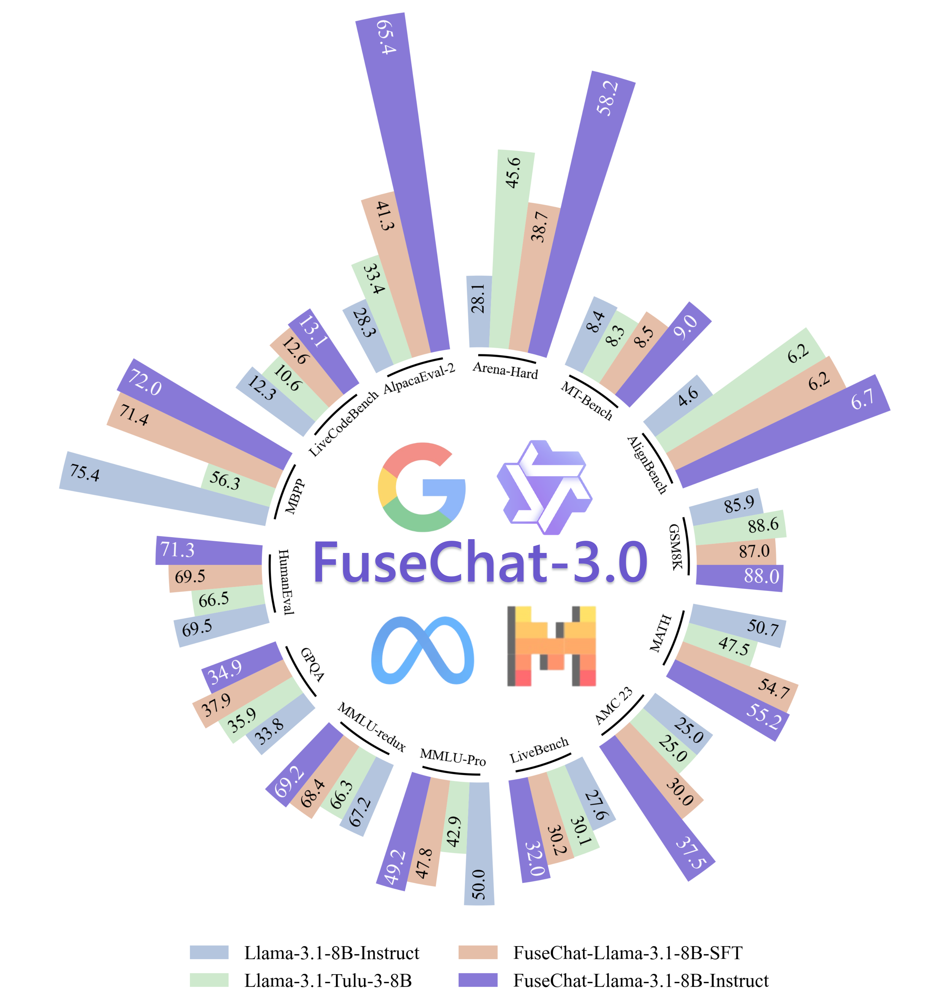

<p align="center" width="100%">
</p>

<div id="top" align="center">

FuseChat-3.0: Preference Optimization for Implicit Model Fusion
-----------------------------
 


<h4> |<a href="https://arxiv.org/abs/2412.03187"> 📑 Paper </a> |
<a href="https://huggingface.co/FuseAI"> 🤗 HuggingFace Repo</a> |
<a href="https://github.com/fanqiwan/FuseLLM"> 🐱 GitHub Repo </a> |
<a href="https://slit-ai.github.io/FuseChat-3.0/"> 🌐 Website </a> |
</h4>

<!-- **Authors:** -->

_Ziyi Yang*, Fanqi Wan*, Longguang Zhong*, Canbin Huang, Guosheng Liang, Xiaojun Quan†_


<!-- **Affiliations:** -->

_Sun Yat-sen University_

_*Main Contributors †Corresponding Author_

</div>

<div align="center">
  
</div>

We present FuseChat-3.0, a series of models crafted to enhance performance by integrating the strengths of multiple source LLMs into more compact target LLMs. To achieve this fusion, we utilized four powerful source LLMs: Gemma-2-27B-It, Mistral-Large-Instruct-2407, Qwen-2.5-72B-Instruct, and Llama-3.1-70B-Instruct. For the target LLMs, we employed three widely-used smaller models—Llama-3.1-8B-Instruct, Gemma-2-9B-It, and Qwen-2.5-7B-Instruct—along with two even more compact models—Llama-3.2-3B-Instruct and Llama-3.2-1B-Instruct. The implicit model fusion process involves a two-stage training pipeline comprising Supervised Fine-Tuning (SFT) to mitigate distribution discrepancies between target and source LLMs, and Direct Preference Optimization (DPO) for learning preferences from multiple source LLMs. The resulting FuseChat-3.0 models demonstrated substantial improvements in tasks related to general conversation, instruction following, mathematics, and coding. Notably, when Llama-3.1-8B-Instruct served as the target LLM, our fusion approach achieved an average improvement of 6.8 points across 14 benchmarks. Moreover, it showed significant improvements of 37.1 and 30.1 points on instruction-following test sets AlpacaEval-2 and Arena-Hard respectively. We have released the [FuseChat-3.0](https://huggingface.co/FuseAI) models on Huggingface, stay tuned for the forthcoming dataset and code.


## Overview
Combining the strengths of multiple large language models (LLMs) represents a promising approach to enhance individual model capabilities. Model fusion is a technique that integrates the strengths of robust source LLMs into a target LLM.

Previous iterations of the [FuseChat](https://arxiv.org/abs/2408.07990) series employed probabilistic distribution matrices generated by source models to transfer knowledge to target models. We refer to this method as **explicit model fusion (EMF)** because it involves a well-defined knowledge transfer process. While applicable to models with varying architectures and sizes, and without increasing memory overhead during inference, this approach presents notable challenges such as vocabulary alignment and the merging of distribution matrices from different LLMs. These issues complicate model fusion, reduce its efficiency, and may introduce noise and errors and affect the fusion results.

FuseChat-3.0, however, takes a different approach by enhancing a single LLM through implicit learning from robust open-source LLMs, a process we term **implicit model fusion (IMF)**. The concept of IMF has been widely utilized to improve the performance of weaker models. For instance, a weak model can be boosted through fine-tuning with outputs from stronger LLMs. Moreover, a reward model can be trained using outputs from various LLMs, enabling it to learn and capture the differences in capabilities between the LLMs. Zephyr further collects responses from multiple LLMs and ranks them with GPT-4 to obtain preference data for training the policy. Inspired by recent alignment techniques, we propose an IMF method to transfer the capabilities of source LLMs to a target LLM through preference optimization.

Our IMF method follows a three-stage process aimed at effectively transferring capabilities from source LLMs to a target LLM. First, during **dataset construction**, we sample N responses from each of the source LLMs and annotate these responses using an external reward model. Second, in the **supervised fine-tuning (SFT)** stage, we fine-tune the target model using the best responses, which not only enhances the target model's capabilities but also helps mitigate the distributional gap between the source and target models. Finally, in the **direct preference optimization (DPO)** stage, we optimize the target model by using the best and worst responses from the source models as preference pairs, further enhancing the target model's performance. The complete pipeline will be detailed in the following paragraph.

## Dataset
### Prompt Selection
Our datasets were designed to enhance model's instruction following, general conversation, mathematics, coding, and Chinese-language capabilities. We selected data from open-source community datasets, applying targeted filtering and preprocessing. Key datasets and filtering criteria included:

- **Instruction Following & General Conversation**: Sourced from [UltraFeedback](https://huggingface.co/datasets/openbmb/UltraFeedback), [Magpie-Pro-DPO-100K-v0.1](https://huggingface.co/datasets/Magpie-Align/Magpie-Pro-DPO-100K-v0.1), and [HelpSteer2](https://huggingface.co/datasets/nvidia/HelpSteer2), excluding code and math data.
- **Mathematics**: Selected from [OpenMathInstruct-2](https://huggingface.co/datasets/nvidia/OpenMathInstruct-2), with nearly 60,000 unique samples.
- **Coding**: Curated from [leetcode](https://huggingface.co/datasets/greengerong/leetcode) and [self-oss-instruct-sc2-exec-filter-50k](https://huggingface.co/datasets/bigcode/self-oss-instruct-sc2-exec-filter-50k), retaining prompts with test cases.
- **Chinese Language**: Integrated [alpaca_gpt4_zh](https://huggingface.co/datasets/llamafactory/alpaca_gpt4_zh) and [Magpie-Qwen2-Pro-200K-Chinese](https://huggingface.co/datasets/Magpie-Align/Magpie-Qwen2-Pro-200K-Chinese), filtering out code and math prompts to retain approximately 10,000 high-quality samples.

### Response Sampling
For each dataset's prompts, we synthesized responses mainly from four different series of source models, specifically [Gemma-2-27b-It](https://huggingface.co/google/gemma-2-27b-it), [Mistral-Large-Instruct-2407](https://huggingface.co/mistralai/Mistral-Large-Instruct-2407), [Qwen-2.5-72B-Instruct](https://huggingface.co/Qwen/Qwen2-72B-Instruct), and [Llama-3.1-70B-Instruct](https://huggingface.co/meta-llama/Llama-3.1-70B-Instruct). Compared to the original approach in [WRPO](https://arxiv.org/abs/2412.03187) using up to ten source LLMs, this streamlined selection ensures both representativeness and accessibility of the experiments.

- **Instruction Following & General Conversation**: We sampled each prompt five times from all the source models.
- **Mathematics**: We retained the responses generated by Llama-3.1-405B-Instruct from the original dataset (OpenMathInstruct-2) and additionally sampled responses using [Qwen-2.5-Math-72B-Instruct](https://huggingface.co/Qwen/Qwen-2.5-Math-72B-Instruct).
- **Coding**: We sampled each prompt eight times for all source models.
- **Chinese Language**: We included single response sampled exclusively from Qwen-2.5-72B-Instruct.

The sampling parameters for different models are detailed in Table below.
 
<table class="js-sort-table table hidden">
  <tr>
    <td class="js-sort-string"><strong>Source LLMs</strong></td>
    <td class="js-sort-string"><strong>Sampling Params</strong></td>
  </tr>

  <tr>
    <td>Gemma-2-27b-It</td>
    <td>Temp 0.8 Top-p 0.95</td>
  </tr>
  
  <tr>
    <td>Mistral-Large-Instruct-2407</td>
    <td>Temp 0.8 Top-p 0.95</td>
  </tr>
  
  <tr>
    <td>Qwen-2.5-(Math)-72B-Instruct</td>
    <td>Temp 0.7 Top-p 0.8 Repetition penalty 1.05</td>
  </tr>
  
  <tr>
    <td>Llama-3.1-70B-Instruct</td>
    <td>Temp 0.8 Top-p 0.95</td>
  </tr>
  

</table>

### Data Construction
Unlike the original approach in [WRPO](https://arxiv.org/abs/2412.03187), which constructs preference pairs from target model responses and treats source model responses as additional positive samples, our research in mathematics and coding domains revealed that sampling from multiple source models yields more and higher-quality preference pair data. Based on this insight, FuseChat-3.0 leverages the best and worst response pairs generated by source models as preference pairs to optimize the target model. This refined approach not only preserves the core advantages of implicit model fusion but also results in a more streamlined and practical implementation, making it particularly well-suited for real-world applications within the open-source community.

- **Instruction Following**: To assign RM scores to the five responses generated by each source model, we employed [ArmoRM](https://huggingface.co/RLHFlow/ArmoRM-Llama3-8B-v0.1) for annotation. We then divided the annotated data into SFT and DPO datasets using a 4:6 ratio. For the SFT phase, we selected the responses with the highest RM scores. During the DPO phase, we paired responses from the same source model, designating those with the highest RM scores as positive samples and those with the lowest RM scores as negative samples. We ensured that the RM score difference between the positive and negative samples in each pair ranged from 0.01 to 0.1.
- **Mathematics**: We initially annotated the responses from all source models for correctness by comparing them with the gold labels and evaluating them using the RM scores provided by ArmoRM. We then strategically divided the dataset into SFT phase and DPO phase. In the SFT phase, we incorporated responses that were correct and had the highest RM scores. This selection ensured that the fine-tuning process was based on high-quality responses that aligned closely with the desired outcomes. For the DPO phase, we constructed paired samples from the same source model. The positive samples consisted of correct answers with the highest RM scores, while the negative samples were incorrect answers with the lowest RM scores. To ensure meaningful comparisons during optimization, we maintained an RM score differential between positive and negative pairs within the range of 0.01 to 0.1.
- **Coding**: We employed a dual-scoring system comprising correctness scores and RM scores for coding evaluation. The correctness scores assessed whether the code passed both static analysis and test cases, ensuring functional accuracy. The RM scores were used for preference evaluation, gauging the quality of responses based on predefined criteria. During the SFT phase, we included responses that not only passed all test cases but also achieved the highest RM scores. This selection ensured that the model was fine-tuned on exemplary code that met both correctness and preference standards. In the DPO phase, we contrasted positive samples—high-scoring responses that passed the tests—with negative samples—low-scoring responses that failed the tests. This comparison aimed to optimize the model's ability to prefer higher-quality code during training. We excluded any instances where all model responses failed to meet the testing criteria. This exclusion was necessary to maintain the integrity of the evaluation process, as such cases did not provide meaningful data for assessing and improving the model's performance.
- **Chinese**: We exclusively utilized responses sampled from Qwen-2.5-72B-Instruct during the SFT phase, due to its strong performance in the Chinese language.

Our final dataset comprised 158,784 total entries, with 94,539 entries for the SFT phase and 64,245 preference pairs for the DPO phase. The overall composition of the datasets is shown below.

<table class="js-sort-table table hidden">
  <tr>
    <td class="js-sort-string"><strong>Dataset</strong></td>
    <td class="js-sort-number"><strong>Total Count</strong></td>
    <td class="js-sort-number"><strong>SFT Count</strong></td>
    <td class="js-sort-number"><strong>DPO Count</strong></td>
    <td class="js-sort-string"><strong>Category</strong></td>
  </tr>

  <tr>
    <td><a href="https://huggingface.co/datasets/openbmb/UltraFeedback" target="_blank">UltraFeedback</a></td>
    <td>51098</td>
    <td>20439</td>
    <td>30659</td>
    <td>Instruction following</td>
  </tr>

  <tr>
    <td><a href="https://huggingface.co/datasets/Magpie-Align/Magpie-Pro-DPO-100K-v0.1" target="_blank">Magpie-Pro-DPO</a></td>
    <td>20374</td>
    <td>8149</td>
    <td>12225</td>
    <td>Instruction following</td>
  </tr>

  <tr>
    <td><a href="https://huggingface.co/datasets/nvidia/HelpSteer2" target="_blank">HelpSteer2</a></td>
    <td>9435</td>
    <td>3774</td>
    <td>5661</td>
    <td>Instruction following</td>
  </tr>

  <tr>
    <td><a href="https://huggingface.co/datasets/nvidia/OpenMathInstruct-2" target="_blank">OpenMathInstruct-2</a></td>
    <td>58546</td>
    <td>40188</td>
    <td>11615</td>
    <td>Mathematics</td>
  </tr>

  <tr>
    <td><a href="https://huggingface.co/datasets/greengerong/leetcode" target="_blank">leetcode</a></td>
    <td>3113</td>
    <td>1877</td>
    <td>1236</td>
    <td>Coding</td>
  </tr>

  <tr>
    <td><a href="https://huggingface.co/datasets/bigcode/self-oss-instruct-sc2-exec-filter-50k" target="_blank">self-oss-instruct-sc2</a></td>
    <td>13696</td>
    <td>10160</td>
    <td>2849</td>
    <td>Coding</td>
  </tr>

  <tr>
    <td><a href="https://huggingface.co/datasets/llamafactory/alpaca_gpt4_zh" target="_blank">alpaca_gpt4_zh</a></td>
    <td>2471</td>
    <td>2471</td>
    <td>0</td>
    <td>Chinese Language</td>
  </tr>

  <tr>
    <td><a href="https://huggingface.co/datasets/Magpie-Align/Magpie-Qwen2-Pro-200K-Chinese" target="_blank">Magpie-Qwen2-Pro</a></td>
    <td>7481</td>
    <td>7481</td>
    <td>0</td>
    <td>Chinese Language</td>
  </tr>

  <tr>
    <td><strong>Total</strong></td>
    <td>158784</td>
    <td>94539</td>
    <td>64245</td>
    <td>All</td>
  </tr>

  
</table>

## Training
The implicit model fusion process involves a two-stage training pipeline comprising Supervised Fine-Tuning (SFT) to mitigate distribution discrepancies between target and source LLMs, and Direct Preference Optimization (DPO) for learning preferences from multiple source LLMs.

### SFT
We used [Llama-Factory](https://github.com/hiyouga/LLaMA-Factory) as our fine-tuning library. For all target models, we fine-tuned for 3 epochs, with a batch size of 128 and a maximum sequence length of 2048 tokens. A cosine learning rate schedule with a warmup ratio of 0.1 is employed. Different models' learning rates are shown in the table below.


<table class="js-sort-table table hidden">
  <tr>
    <td class="js-sort-string"><strong>Target Models</strong></td>
    <td class="js-sort-string"><strong>Learning rate</strong></td>
  </tr>

  <tr>
    <td>Llama-3.1-8B-Instruct</td>
    <td>5e-6</td>
  </tr>

  <tr>
    <td>Qwen-2.5-7B-Instruct</td>
    <td>2e-6</td>
  </tr>

  <tr>
    <td>Gemma-2-9B-It</td>
    <td>2e-6</td>
  </tr>

  <tr>
    <td>Llama-3.2-(1/3)B-Instruct</td>
    <td>5e-6</td>
  </tr>

  
</table>

### DPO
We used [alignment-handbook](https://github.com/huggingface/alignment-handbook) as our DPO training library. For all Target SFT models, we trained for 1 epoch with a batch size of 128, set maximum sequence length to 2048, used cosine learning rate with a warmup ratio of 0.1. We saved checkpoints every 100 steps and selected the best from the last two checkpoints. For Llama-3.1 and Llama-3.2 series models, we introduced length normalization in DPO training, as shown in the formula below.

}{\pi_{\text{ref}}(y_w|x)}-\frac{\beta}{|y_l|}\log\frac{\pi_\theta(y_l|x)}{\pi_{\text{ref}}(y_l|x)}\right))

Different models' hyperparameters are shown in the table below.

<table class="js-sort-table table hidden">
  <tr>
    <td class="js-sort-string"><strong>Target SFT Models</strong></td>
    <td class="js-sort-string"><strong>Learning rate</strong></td>
    <td class="js-sort-string"><strong>β</strong></td>
    <td class="js-sort-string"><strong>Length normalize</strong></td>
  </tr>

  <tr>
    <td>FuseChat-Llama-3.1-8B-SFT</td>
    <td>8e-7</td>
    <td>10</td>
    <td>Yes</td>
  </tr>

  <tr>
    <td>FuseChat-Qwen-2.5-7B-SFT</td>
    <td>3e-7</td>
    <td>0.01</td>
    <td>No</td>
  </tr>

  <tr>
    <td>FuseChat-Gemma-2-9B-SFT</td>
    <td>5e-7</td>
    <td>0.01</td>
    <td>No</td>
  </tr>

  <tr>
    <td>FuseChat-Llama-3.2-(1/3)B-SFT</td>
    <td>1e-6</td>
    <td>10</td>
    <td>Yes</td>
  </tr>

           
</table>


## Evaluation
The evaluation of instruction-tuned models mainly focuses on the model performance of instruction following, natural language understanding, general question answering, reasoning, mathematics, coding, etc. For the evaluation of FuseChat-3.0, we include 14 benchmarks and organize them into four categories:

- **Instruction Following** Tasks: AlpacaEval-2, Arena-Hard, MTbench, AlignBench v1.1 (Chinese).
- **General** Tasks: LiveBench-0831, MMLU-Pro, MMLU-redux, GPQA-Diamond.
- **Mathematics** Tasks: GSM8K, MATH, AMC 23.
- **Coding** Tasks: HumanEval, MBPP, LiveCodeBench 2408-2411.

We include more details and release our evaluation code at [FuseEval](https://github.com/SLIT-AI/FuseChat-3.0/FuseEval).

The evaluation results of five series fused models are as follows, showing that our FuseChat-3.0 models achieved varying degrees of improvement across different target models. When selecting Llama-3.1-8B-Instruct as the target model, our fusion model **FuseChat-Llama-3.1-8B-Instruct achieved an average performance improvement of 6.8 points across 14 benchmarks. Notably, it showed significant improvements of 37.1 and 30.1 points on instruction-following test sets AlpacaEval-2 and Arena-Hard respectively**. Additionally, FuseChat-Llama-3.1-8B-Instruct outperformed AllenAI's recently released Llama-3.1-Tulu-3-8B model on all benchmarks except GSM8K and GPQA-Diamond. All these results demonstrate the effectiveness and success of FuseChat-3.0.

### FuseChat-Llama-3.1-8B-Instruct Performance

<table class="js-sort-table table hidden">
  <tr>
    <td class="js-sort-string"><strong>Benchmarks</strong></td>
    <td class="js-sort-string"><strong>Llama-3.1-8B-Instruct</strong></td>
    <td class="js-sort-string"><strong>Llama-3.1-Tulu-3-8B</strong></td>
    <td class="js-sort-string"><strong>FuseChat-Llama-3.1-8B-SFT</strong></td>
    <td class="js-sort-string"><strong>FuseChat-Llama-3.1-8B-Instruct</strong></td>
  </tr>

  <tr>
    <td style="white-space: nowrap;">AlpacaEval-2 (LC %)</td>
    <td>28.3</td>
    <td>33.4</td>
    <td>41.3</td>
    <td><strong>65.4</strong></td>
  </tr>

  <tr>
    <td>Arena-Hard (WR %)</td>
    <td>28.1</td>
    <td>45.6</td>
    <td>38.7</td>
    <td><strong>58.2</strong></td>
  </tr>

  <tr>
    <td>MT-Bench</td>
    <td>8.4</td>
    <td>8.3</td>
    <td>8.5</td>
    <td><strong>9.0</strong></td>
  </tr>

  <tr>
    <td>AlignBench v1.1</td>
    <td>4.6</td>
    <td>6.2</td>
    <td>6.3</td>
    <td><strong>6.7</strong></td>
  </tr>

  <tr>
    <td>GSM8K</td>
    <td>85.9</td>
    <td><strong>88.6</strong></td>
    <td>87.0</td>
    <td>88.0</td>
  </tr>

  <tr>
    <td>MATH</td>
    <td>50.7</td>
    <td>47.5</td>
    <td>54.7</td>
    <td><strong>55.2</strong></td>
  </tr>

  <tr>
    <td>AMC 23</td>
    <td>25.0</td>
    <td>25.0</td>
    <td>30.0</td>
    <td><strong>37.5</strong></td>
  </tr>

  <tr>
    <td>LiveBench 0831</td>
    <td>27.6</td>
    <td>30.1</td>
    <td>30.2</td>
    <td><strong>32.0</strong></td>
  </tr>

  <tr>
    <td>MMLU-Pro</td>
    <td><strong>50.0</strong></td>
    <td>42.9</td>
    <td>47.8</td>
    <td>49.2</td>
  </tr>

  <tr>
    <td>MMLU-redux</td>
    <td>67.2</td>
    <td>66.3</td>
    <td>68.4</td>
    <td><strong>69.2</strong></td>
  </tr>

  <tr>
    <td>GPQA-Diamond</td>
    <td>33.8</td>
    <td>35.9</td>
    <td><strong>37.9</strong></td>
    <td>34.9</td>
  </tr>

  <tr>
    <td>HumanEval</td>
    <td>69.5</td>
    <td>66.5</td>
    <td>69.5</td>
    <td><strong>71.3</strong></td>
  </tr>

  <tr>
    <td>MBPP</td>
    <td><strong>75.4</strong></td>
    <td>56.3</td>
    <td>71.4</td>
    <td>72.0</td>
  </tr>

  <tr>
    <td>LiveCodeBench<br>2408-2411</td>
    <td>12.3</td>
    <td>10.6</td>
    <td>12.6</td>
    <td><strong>13.1</strong></td>
  </tr>

  <tr>
    <td>Average</td>
    <td>40.5</td>
    <td>40.2</td>
    <td>43.2</td>
    <td><strong>47.3</strong></td>
  </tr>
</table>

### FuseChat-Qwen-2.5-7B-Instruct Performance

<table class="js-sort-table table hidden">
  <tr>
    <td class="js-sort-string"><strong>Datasets</strong></td>
    <td class="js-sort-string"><strong>Qwen-2.5-7B-Instruct</strong></td>
    <td class="js-sort-string"><strong>FuseChat-Qwen-2.5-7B-SFT</strong></td>
    <td class="js-sort-string"><strong>FuseChat-Qwen-2.5-7B-Instruct</strong></td>
  </tr>

  <tr>
    <td style="white-space: nowrap;">AlpacaEval-2 (LC %)</td>
    <td>33.2</td>
    <td>34.2</td>
    <td><strong>63.6</strong></td>
  </tr>

  <tr>
    <td>Arena-Hard (WR %)</td>
    <td>50.7</td>
    <td>45.2</td>
    <td><strong>61.4</strong></td>
  </tr>

  <tr>
    <td>MT-Bench</td>
    <td>8.4</td>
    <td>8.5</td>
    <td><strong>9.0</strong></td>
  </tr>

  <tr>
    <td>AlignBench v1.1</td>
    <td>7.5</td>
    <td>7.4</td>
    <td><strong>7.6</strong></td>
  </tr>

  <tr>
    <td>GSM8K</td>
    <td>91.7</td>
    <td><strong>92.3</strong></td>
    <td>91.7</td>
  </tr>

  <tr>
    <td>MATH</td>
    <td><strong>75.0</strong></td>
    <td>72.7</td>
    <td>73.6</td>
  </tr>

  <tr>
    <td>AMC 23</td>
    <td>52.5</td>
    <td>45.0</td>
    <td><strong>57.5</strong></td>
  </tr>
  
  <tr>
    <td>LiveBench-0831</td>
    <td><strong>35.4</strong></td>
    <td>33.7</td>
    <td>33.2</td>
  </tr>   
  
  <tr>
    <td>MMLU-Pro</td>
    <td><strong>54.1</strong></td>
    <td>51.7</td>
    <td>53.0</td>
  </tr>

  <tr>
    <td>MMLU-redux</td>
    <td><strong>75.1</strong></td>
    <td>72.7</td>
    <td>74.4</td>
  </tr>

  <tr>
    <td>GPQA-Diamond</td>
    <td>34.9</td>
    <td><strong>38.4</strong></td>
    <td>33.8</td>
  </tr>

  <tr>
    <td>HumanEval</td>
    <td><strong>85.4</strong></td>
    <td>81.7</td>
    <td>79.9</td>
  </tr>

  <tr>
    <td>MBPP</td>
    <td>80.2</td>
    <td><strong>84.1</strong></td>
    <td>83.1</td>
  </tr>

  <tr>
    <td>LiveCodeBench<br>2408-2411</td>
    <td>15.8</td>
    <td>17.3</td>
    <td><strong>18.9</strong></td>
  </tr>

  <tr>
    <td>Average</td>
    <td>50.0</td>
    <td>48.9</td>
    <td><strong>52.9</strong></td>
  </tr>
</table>

### FuseChat-Gemma-2-9B-Instruct Performance

<table class="js-sort-table table hidden">
  <tr>
    <td class="js-sort-string"><strong>Datasets</strong></td>
    <td class="js-sort-string"><strong>Gemma-2-9B-It</strong></td>
    <td class="js-sort-string"><strong>FuseChat-Gemma-2-9B-SFT</strong></td>
    <td class="js-sort-string"><strong>FuseChat-Gemma-2-9B-Instruct</strong></td>
  </tr>

  <tr>
    <td style="white-space: nowrap;">AlpacaEval-2 (LC %)</td>
    <td>51.1</td>
    <td>49.8</td>
    <td><strong>70.2</strong></td>
  </tr>

  <tr>
    <td>Arena-Hard (WR %)</td>
    <td>40.8</td>
    <td>44.5</td>
    <td><strong>63.4</strong></td>
  </tr>

  <tr>
    <td>MT-Bench</td>
    <td>8.5</td>
    <td><strong>8.7</strong></td>
    <td>8.6</td>
  </tr>

  <tr>
    <td>AlignBench v1.1</td>
    <td>7.0</td>
    <td>7.1</td>
    <td><strong>7.4</strong></td>
  </tr>

  <tr>
    <td>GSM8K</td>
    <td>88.5</td>
    <td>90.5</td>
    <td><strong>91.0</strong></td>
  </tr>

  <tr>
    <td>MATH</td>
    <td>49.6</td>
    <td><strong>58.0</strong></td>
    <td>57.8</td>
  </tr>

  <tr>
    <td>AMC 23</td>
    <td>20.0</td>
    <td>27.5</td>
    <td><strong>35.0</strong></td>
  </tr>

  <tr>
    <td>LiveBench-0831</td>
    <td>31.6</td>
    <td><strong>33.3</strong></td>
    <td>33.2</td>
  </tr>
  
  <tr>
    <td>MMLU-Pro</td>
    <td>50.5</td>
    <td>52.5</td>
    <td><strong>52.9</strong></td>
  </tr>

  <tr>
    <td>MMLU-redux</td>
    <td>72.8</td>
    <td>72.8</td>
    <td><strong>73.7</strong></td>
  </tr>

  <tr>
    <td>GPQA-Diamond</td>
    <td><strong>39.4</strong></td>
    <td>33.3</td>
    <td>35.4</td>
  </tr>

  <tr>
    <td>HumanEval</td>
    <td><strong>67.1</strong></td>
    <td>65.9</td>
    <td>64.0</td>
  </tr>

  <tr>
    <td>MBPP</td>
    <td><strong>75.1</strong></td>
    <td>70.6</td>
    <td>71.7</td>
  </tr>

  <tr>
    <td>LiveCodeBench<br>2408-2411</td>
    <td><strong>11.9</strong></td>
    <td>11.0</td>
    <td>10.1</td>
  </tr>

  <tr>
    <td>Average</td>
    <td>43.9</td>
    <td>44.7</td>
    <td><strong>48.2</strong></td>
  </tr>
</table>

### FuseChat-Llama-3.2-3B-Instruct Performance

<table class="js-sort-table table hidden">
  <tr>
    <td class="js-sort-string"><strong>Benchmarks</strong></td>
    <td class="js-sort-string"><strong>Llama-3.2-3B-Instruct</strong></td>
    <td class="js-sort-string"><strong>FuseChat-Llama-3.2-3B-SFT</strong></td>
    <td class="js-sort-string"><strong>FuseChat-Llama-3.2-3B-Instruct</strong></td>
  </tr>

  <tr>
    <td style="white-space: nowrap;">AlpacaEval-2 (LC %)</td>
    <td>21.4</td>
    <td>31.1</td>
    <td><strong>54.0</strong></td>
  </tr>

  <tr>
    <td>Arena-Hard (WR %)</td>
    <td>16.6</td>
    <td>21.3</td>
    <td><strong>30.2</strong></td>
  </tr>

  <tr>
    <td>MT-Bench</td>
    <td>6.9</td>
    <td>7.3</td>
    <td><strong>7.7</strong></td>
  </tr>

  <tr>
    <td>AlignBench v1.1</td>
    <td>3.8</td>
    <td>5.5</td>
    <td><strong>5.9</strong></td>
  </tr>

  <tr>
    <td>GSM8K</td>
    <td>82.0</td>
    <td><strong>82.8</strong></td>
    <td>82.0</td>
  </tr>

  <tr>
    <td>MATH</td>
    <td>51.4</td>
    <td>52.9</td>
    <td><strong>53.1</strong></td>
  </tr>

  <tr>
    <td>AMC23</td>
    <td>22.5</td>
    <td>20.0</td>
    <td><strong>35.0</strong></td>
  </tr>

  <tr>
    <td>LiveBench 0831</td>
    <td>23.4</td>
    <td>24.5</td>
    <td><strong>24.9</strong></td>
  </tr>
        
  <tr>
    <td>MMLU-Pro</td>
    <td>39.3</td>
    <td><strong>40.3</strong></td>
    <td>40.3</td>
  </tr>

  <tr>
    <td>MMLU-redux</td>
    <td>58.5</td>
    <td>58.2</td>
    <td><strong>59.0</strong></td>
  </tr>

  <tr>
    <td>GPQA-Diamond</td>
    <td>29.8</td>
    <td>33.3</td>
    <td><strong>33.8</strong></td>
  </tr>

  <tr>
    <td>HumanEval</td>
    <td>61.0</td>
    <td><strong>62.8</strong></td>
    <td>60.4</td>
  </tr>

  <tr>
    <td>MBPP</td>
    <td><strong>68.5</strong></td>
    <td>67.5</td>
    <td>67.5</td>
  </tr>

  <tr>
    <td>LiveCodeBench<br>2408-2411</td>
    <td>8.3</td>
    <td>7.1</td>
    <td><strong>9.0</strong></td>
  </tr>

  <tr>
    <td>Average</td>
    <td>35.2</td>
    <td>36.8</td>
    <td><strong>40.2</strong></td>
  </tr>
</table>


### FuseChat-Llama-3.2-1B-Instruct Performance

<table class="js-sort-table table hidden">
  <tr>
    <td class="js-sort-string"><strong>Benchmarks</strong></td>
    <td class="js-sort-string"><strong>Llama-3.2-1B-Instruct</strong></td>
    <td class="js-sort-string"><strong>FuseChat-Llama-3.2-1B-SFT</strong></td>
    <td class="js-sort-string"><strong>FuseChat-Llama-3.2-1B-Instruct</strong></td>
  </tr>

  <tr>
    <td style="white-space: nowrap;">AlpacaEval-2 (LC %)</td>
    <td>9.7</td>
    <td>14.0</td>
    <td><strong>25.3</strong></td>
  </tr>

  <tr>
    <td>Arena-Hard (WR %)</td>
    <td>5.1</td>
    <td>6.0</td>
    <td><strong>8.6</strong></td>
  </tr>

  <tr>
    <td>MT-Bench</td>
    <td>4.7</td>
    <td>5.2</td>
    <td><strong>5.7</strong></td>
  </tr>

  <tr>
    <td>AlignBench v1.1</td>
    <td>2.9</td>
    <td>3.9</td>
    <td><strong>4.3</strong></td>
  </tr>

  <tr>
    <td>GSM8K</td>
    <td>46.3</td>
    <td><strong>55.6</strong></td>
    <td>54.5</td>
  </tr>

  <tr>
    <td>MATH</td>
    <td>32.7</td>
    <td><strong>34.7</strong></td>
    <td>33.6</td>
  </tr>

  <tr>
    <td>AMC23</td>
    <td>17.5</td>
    <td>15.0</td>
    <td><strong>20.0</strong></td>
  </tr>
  
  <tr>
    <td>LiveBench 0831</td>
    <td>14.0</td>
    <td>13.9</td>
    <td><strong>15.8</strong></td>
  </tr>
      
  <tr>
    <td>MMLU-Pro</td>
    <td><strong>22.3</strong></td>
    <td>21.5</td>
    <td>21.3</td>
  </tr>

  <tr>
    <td>MMLU</td>
    <td><strong>45.8</strong></td>
    <td>45.0</td>
    <td>44.8</td>
  </tr>

  <tr>
    <td>GPQA-Diamond</td>
    <td>21.2</td>
    <td><strong>25.3</strong></td>
    <td>24.2</td>
  </tr>

  <tr>
    <td>HumanEval</td>
    <td>39.6</td>
    <td>36.6</td>
    <td><strong>40.2</strong></td>
  </tr>

  <tr>
    <td>MBPP</td>
    <td><strong>49.5</strong></td>
    <td>42.1</td>
    <td>46.6</td>
  </tr>

  <tr>
    <td>Average</td>
    <td>24.0</td>
    <td>24.5</td>
    <td><strong>26.5</strong></td>
  </tr>
</table>


## BibTeX
```
@article{yang2024wrpo,
  title={Weighted-Reward Preference Optimization for Implicit Model Fusion},
  author={Ziyi Yang and Fanqi Wan and Longguang Zhong and Tianyuan Shi and Xiaojun Quan},
  journal={arXiv preprint arXiv:2412.03187},
  year={2024}
}
```
