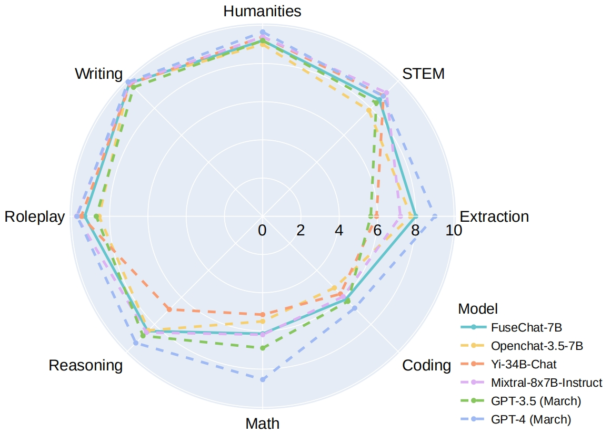
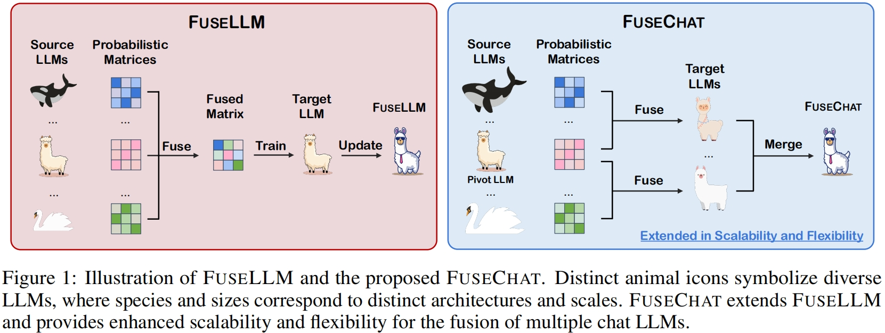
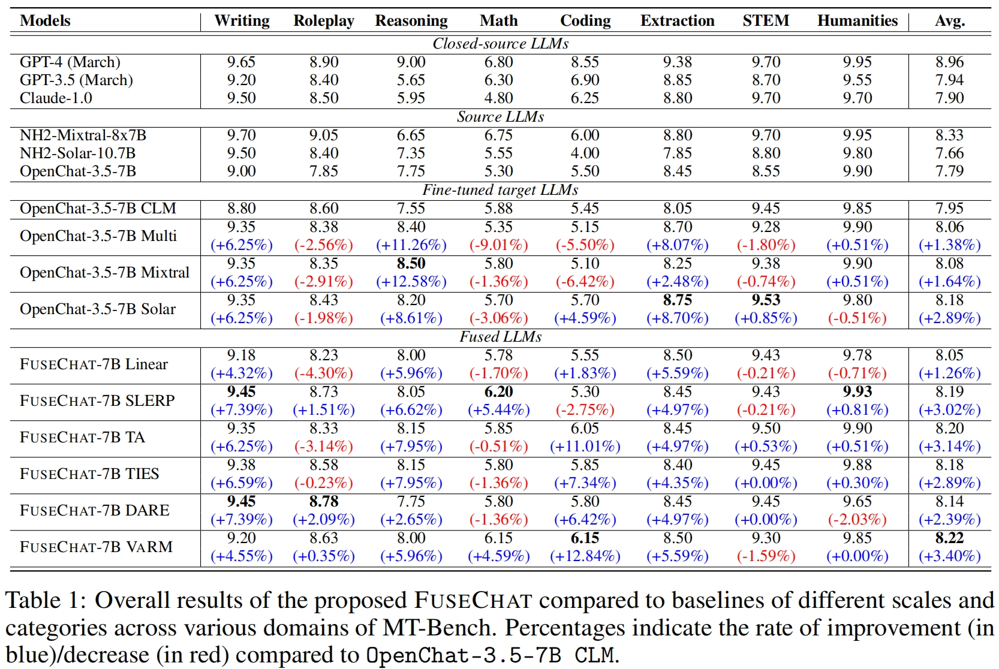

<p align="center" width="100%">
</p>

<div id="top" align="center">

FuseChat: Knowledge Fusion of Chat Models
-----------------------------
 


<h4> |<a href="https://arxiv.org/abs/2402.16107"> 📑 Paper </a> |
<a href="https://huggingface.co/FuseAI"> 🤗 Huggingface Repo </a> |
<a href="https://github.com/fanqiwan/FuseLLM"> 🐱 Github Repo </a> |
</h4>

<!-- **Authors:** -->

_**Fanqi Wan, Ziyi Yang, Longguang Zhong, Xiaojun Quan, Xinting Huang, Wei Bi**_


<!-- **Affiliations:** -->


_Sun Yat-sen University_

<p align="center">
     <br>
</p>

</div>


## News
- **Feb 26, 2024:** 🔥 We release [FuseChat-7B-VaRM](https://huggingface.co/FuseAI/FuseChat-7B-VaRM), which is the fusion of three prominent chat LLMs with diverse architectures and scales, namely [NH2-Mixtral-8x7B](https://huggingface.co/NousResearch/Nous-Hermes-2-Mixtral-8x7B-DPO), [NH2-Solar-10.7B](https://huggingface.co/NousResearch/Nous-Hermes-2-SOLAR-10.7B), and [OpenChat-3.5-7B](https://huggingface.co/openchat/openchat_3.5). FuseChat-7B-VaRM achieves an average performance of **8.22** on MT-Bench, outperforming various powerful chat LLMs at 7B and 34B scales like [Starling-7B](https://huggingface.co/berkeley-nest/Starling-LM-7B-alpha) and [Yi-34B-Chat](https://huggingface.co/01-ai/Yi-34B-Chat), even surpassing [GPT-3.5 (March)](https://platform.openai.com/docs/models/gpt-3-5-turbo), [Claude-2.1](https://www.anthropic.com/news/claude-2-1), and approaching [Mixtral-8x7B-Instruct](https://huggingface.co/mistralai/Mixtral-8x7B-Instruct-v0.1). 


## Contents

- [Overview](#overview)
- [Model Release](#model-release)
- [Quick Start](#quick-start)
- [Data Construction](#data-construction)
- [Pairwise Knowledge Fusion](#pairwise-knowledge-fusion)
- [Model Merging](#model-merging)
- [Evaluation](#evaluation)
- [Citation](#citation)

## Overview
 
In this work, we propose an extended framework of FuseLLM to integrate the collective knowledge and individual strengths of multiple structure and scale-varied chat LLMs into a more powerful chat LLM, resulting in FuseChat. FuseChat adopts a fuse-then-merge strategy with two main stages. Firstly, it undertakes pairwise knowledge fusion for source LLMs to derive multiple target LLMs of identical structure and size via lightweight fine-tuning. Then, these target LLMs are merged within the parameter space, wherein we propose a novel method VaRM for determining the merging weights based on the variation ratio of parameter matrices before and after fine-tuning. 


Moreover, we argue that the concept of knowledge fusion adopted by both FuseChat and FuseLLM shares a fundamentally similar purpose with other related topics, such as the recently popular topic of mixture of experts (MoEs), because they all aim to leverage the strengths of multiple models (experts). However, while MoEs require loading multiple experts during inference, which has higher memory requirements, knowledge fusion supports the integration of multiple LLMs with diverse architectures into a single LLM without any additional memory requirement, making it more memory-efficient. 

<p align="center">
     <br>
</p>


## Model Release

We release [FuseChat-7B-VaRM](https://huggingface.co/FuseAI/FuseChat-7B-VaRM), which is the fusion of three prominent chat LLMs with diverse architectures and scales, namely [NH2-Mixtral-8x7B](https://huggingface.co/NousResearch/Nous-Hermes-2-Mixtral-8x7B-DPO), [NH2-Solar-10.7B](https://huggingface.co/NousResearch/Nous-Hermes-2-SOLAR-10.7B), and [OpenChat-3.5-7B](https://huggingface.co/openchat/openchat_3.5).

To support a plug-and-play fusion of new source LLM, we release our target LLMs: [OpenChat-3.5-7B-Solar](https://huggingface.co/FuseAI/OpenChat-3.5-7B-Solar) and [OpenChat-3.5-7B-Mixtral](https://huggingface.co/FuseAI/OpenChat-3.5-7B-Mixtral), which are obtained from pair-wise knowledge fusion. Integrating a new source LLM at any scale requires only obtaining a target LLM from the new source LLM and merging it with the existing target LLMs.

We also release FuseChat with other merging methods: [FuseChat-7B-SLERP](https://huggingface.co/FuseAI/FuseChat-7B-SLERP) and [FuseChat-7B-TA](https://huggingface.co/FuseAI/FuseChat-7B-TA), which achieves an average performance of **8.19** and **8.20** on MT-Bench respectively.

Here are the evaluation results.

<p align="center">
     <br>
</p>

## Quick Start

### Setup

We use `python 3.11` in this project.

Then, we have to install all the libraries listed in `requirements.txt`.

```bash
pip install -r requirements.txt
```

### Usage

Here's how you can run the model using the 🤗 Transformers:

```python
import transformers
tokenizer = transformers.AutoTokenizer.from_pretrained("FuseAI/FuseChat-7B-VaRM")
# Single-turn
tokens = tokenizer("GPT4 Correct User: Hello<|end_of_turn|>GPT4 Correct Assistant:").input_ids
assert tokens == [1, 420, 6316, 28781, 3198, 3123, 1247, 28747, 22557, 32000, 420, 6316, 28781, 3198, 3123, 21631, 28747]
# Multi-turn
tokens = tokenizer("GPT4 Correct User: Hello<|end_of_turn|>GPT4 Correct Assistant: Hi<|end_of_turn|>GPT4 Correct User: How are you today?<|end_of_turn|>GPT4 Correct Assistant:").input_ids
assert tokens == [1, 420, 6316, 28781, 3198, 3123, 1247, 28747, 22557, 32000, 420, 6316, 28781, 3198, 3123, 21631, 28747, 15359, 32000, 420, 6316, 28781, 3198, 3123, 1247, 28747, 1602, 460, 368, 3154, 28804, 32000, 420, 6316, 28781, 3198, 3123, 21631, 28747]
```

The GPT4 template is also available as the integrated `tokenizer.chat_template`, which can be used instead of manually specifying the template:

```python
messages = [
    {"role": "user", "content": "Hello"},
    {"role": "assistant", "content": "Hi"},
    {"role": "user", "content": "How are you today?"}
]
tokens = tokenizer.apply_chat_template(messages, add_generation_prompt=True)
assert tokens == [1, 420, 6316, 28781, 3198, 3123, 1247, 28747, 22557, 32000, 420, 6316, 28781, 3198, 3123, 21631, 28747, 15359, 32000, 420, 6316, 28781, 3198, 3123, 1247, 28747, 1602, 460, 368, 3154, 28804, 32000, 420, 6316, 28781, 3198, 3123, 21631, 28747]
```

## Data Construction

We curated a comprehensive training dataset, [FuseChat-Mixture](https://huggingface.co/datasets/FuseAI/FuseChat-Mixture), from various sources. This dataset covers different styles and capabilities, featuring both human-written and model-generated, and spanning general instruction-following and specific skills. 

Here we show the scripts to obtain representations from multiple source LLMs for model fusion.

1. Get representations for each source LLM

```bash
# We split the dataset into 4 splits, then process each split on one or multiple GPU.

# OpenChat-3.5-7B
export CUDA_VISIBLE_DEVICES=0
for i in {0..3}; do
python /train/get_data_representation.py \
  --model_name_or_path "openchat/openchat_3.5" \
  --data_path "/data/fusechat_v1_clean_split_2048_filter_wrong.json" \
  --dataset_save_dir "<${i}_4_path_to_openchat_representation>" \
  --tknz_dataset_path "<${i}_4_path_to_openchat_tknz>" \
  --cache_dir "/.cache/huggingface/datasets" \
  --model_max_length 2048 \
  --load_in_half bf16 \
  --batch_size 32 \
  --top_k_logits 10 \
  --save_per_token_metric \
  --no_assert \
  --conv_temp "openchat" \
  --flash_attn_transformers \
  --mask_instruction \
  --dataset_split_num 4 \
  --dataset_index ${i}
done 

# NH2-Mixtral-8x7B
export CUDA_VISIBLE_DEVICES=0,1,2
for i in {0..3}; do
python /train/get_data_representation.py \
  --model_name_or_path "NousResearch/Nous-Hermes-2-Mixtral-8x7B-DPO" \
  --data_path "/data/fusechat_v1_clean_split_2048_filter_wrong.json" \
  --dataset_save_dir "<${i}_4_path_to_mixtral_representation>" \
  --tknz_dataset_path "<${i}_4_path_to_mixtral_tknz>" \
  --cache_dir "/.cache/huggingface/datasets" \
  --model_max_length 2048 \
  --load_in_half bf16 \
  --batch_size 4 \
  --top_k_logits 10 \
  --save_per_token_metric \
  --no_assert \
  --conv_temp "openchat" \
  --flash_attn_transformers \
  --mask_instruction \
  --device_map "auto" \
  --dataset_split_num 4 \
  --dataset_index ${i}
done 

# NH2-Solar-10.7B
export CUDA_VISIBLE_DEVICES=0
for i in {0..3}; do
python /train/get_data_representation.py \
  --model_name_or_path "NousResearch/Nous-Hermes-2-SOLAR-10.7B" \
  --data_path "/data/fusechat_v1_clean_split_2048_filter_wrong.json" \
  --dataset_save_dir "<${i}_4_path_to_solar_representation>" \
  --tknz_dataset_path "<${i}_4_path_to_solar_tknz>" \
  --cache_dir "/.cache/huggingface/datasets" \
  --model_max_length 2048 \
  --load_in_half bf16 \
  --batch_size 8 \
  --top_k_logits 10 \
  --save_per_token_metric \
  --no_assert \
  --conv_temp "openchat" \
  --flash_attn_transformers \
  --mask_instruction \
  --dataset_split_num 4 \
  --dataset_index ${i}
done 
```

2. Align representations from different source LLMs

```bash
# Since the tokenizers and vocabularies of these source LLMs are identical, we do not align.

# OpenChat-3.5-7B <-> NH2-Mixtral-8x7B
for i in {0..3}; do
python /train/replace_model.py \
  --dataset_dir "<${i}_4_path_to_openchat_representation>" \
  --replace_dataset_dir "<${i}_4_path_to_mixtral_representation>" \
  --dataset_save_dir "<${i}_4_path_to_openchat_mixtral_representation>" \
  --preprocessing_num_workers 64 \
  --batch_size 1000 \
  --replace_model model_0
done 

# OpenChat-3.5-7B <-> NH2-Solar-10.7B
for i in {0..3}; do
python /train/replace_model.py \
  --dataset_dir "<${i}_4_path_to_openchat_mixtral_representation>" \
  --replace_dataset_dir "<${i}_4_path_to_solar_representation>" \
  --dataset_save_dir "<${i}_4_path_to_openchat_mixtral_solar_representation>" \
  --preprocessing_num_workers 64 \
  --batch_size 1000 \
  --replace_model model_1
done
```

3. Filter instances with NaN loss in the dataset

```bash
for i in {0..3}; do
python /train/filter_nan.py \
  --input_data_dir "<${i}_4_path_to_openchat_mixtral_solar_representation>" \
  --output_data_dir "<${i}_4_path_to_openchat_mixtral_solar_representation_fnan>"
done
```

The final processed data is at `<${i}_4_path_to_openchat_mixtral_solar_representation_fnan>`.

## Pairwise Knowledge Fusion

We show the scripts for pairwise knowledge fusion.

```bash
# OpenChat-3.5-7B <-> NH2-Mixtral-8x7B
export CUDA_VISIBLE_DEVICES=0,1,2,3,4,5,6,7
torchrun --nproc_per_node=8 --master_port=20001 /train/train.py \
  --model_name_or_path "openchat/openchat_3.5" \
  --data_path "<0_4_path_to_openchat_mixtral_solar_representation_fnan>,<1_4_path_to_openchat_mixtral_solar_representation_fnan>,<2_4_path_to_openchat_mixtral_solar_representation_fnan>,<3_4_path_to_openchat_mixtral_solar_representation_fnan>" \
  --bf16 True \
  --output_dir "<path_to_save_openchat_mixtral_ckpt>" \
  --num_train_epochs 3 \
  --per_device_train_batch_size 4 \
  --per_device_eval_batch_size 4 \
  --gradient_accumulation_steps 4 \
  --evaluation_strategy "no" \
  --save_strategy "epoch" \
  --save_steps 10000 \
  --save_total_limit 5 \
  --learning_rate 5e-6 \
  --weight_decay 0. \
  --warmup_ratio 0.03 \
  --lr_scheduler_type "cosine" \
  --logging_steps 1 \
  --fsdp "full_shard auto_wrap" \
  --fsdp_transformer_layer_cls_to_wrap 'MistralDecoderLayer' \
  --tf32 True \
  --model_max_length 2048 \
  --gradient_checkpointing True \
  --conv_temp "openchat" \
  --lazy_preprocess True \
  --flash_attn_transformers True \
  --do_train \
  --do_distill \
  --distill_with_ref_model True \
  --distill_with_aligned_model_0 True \
  --distill_with_aligned_model_1 False \
  --distill_loss_type "ce" \
  --distill_teacher_temperature 1.0 \
  --lm_loss_weight 0.9 \
  --distill_greater_as_gt True \
  --distill_greater_as_gt_type hard \
  --dataloader_num_workers 8 \
  --remove_unused_columns False

# OpenChat-3.5-7B <-> NH2-Solar-10.7B
export CUDA_VISIBLE_DEVICES=0,1,2,3,4,5,6,7
torchrun --nproc_per_node=8 --master_port=20001 /train/train.py \
  --model_name_or_path "openchat/openchat_3.5" \
  --data_path "<0_4_path_to_openchat_mixtral_solar_representation_fnan>,<1_4_path_to_openchat_mixtral_solar_representation_fnan>,<2_4_path_to_openchat_mixtral_solar_representation_fnan>,<3_4_path_to_openchat_mixtral_solar_representation_fnan>" \
  --bf16 True \
  --output_dir "<path_to_save_openchat_solar_ckpt>" \
  --num_train_epochs 3 \
  --per_device_train_batch_size 4 \
  --per_device_eval_batch_size 4 \
  --gradient_accumulation_steps 4 \
  --evaluation_strategy "no" \
  --save_strategy "epoch" \
  --save_steps 10000 \
  --save_total_limit 5 \
  --learning_rate 5e-6 \
  --weight_decay 0. \
  --warmup_ratio 0.03 \
  --lr_scheduler_type "cosine" \
  --logging_steps 1 \
  --fsdp "full_shard auto_wrap" \
  --fsdp_transformer_layer_cls_to_wrap 'MistralDecoderLayer' \
  --tf32 True \
  --model_max_length 2048 \
  --gradient_checkpointing True \
  --conv_temp "openchat" \
  --lazy_preprocess True \
  --flash_attn_transformers True \
  --do_train \
  --do_distill \
  --distill_with_ref_model True \
  --distill_with_aligned_model_0 False \
  --distill_with_aligned_model_1 True \
  --distill_loss_type "ce" \
  --distill_teacher_temperature 1.0 \
  --lm_loss_weight 0.9 \
  --distill_greater_as_gt True \
  --distill_greater_as_gt_type hard \
  --dataloader_num_workers 8 \
  --remove_unused_columns False
```

## Model Merging

We show the scripts to obtain the final FuseChat using different merging methods.

```bash
# For "slerp", "ta", "ties", and "dare" methods (Please install "mergekit")
export CUDA_VISIBLE_DEVICES=0
mergekit-yaml merge/mergekit_configs/fusechat-slerp.yml "<path_to_save_fusechat_7b_slerp>"
mergekit-yaml merge/mergekit_configs/fusechat-ta.yml "<path_to_save_fusechat_7b_ta>"
mergekit-yaml merge/mergekit_configs/fusechat-ties.yml "<path_to_save_fusechat_7b_ties>"
mergekit-yaml merge/mergekit_configs/fusechat-dare.yml "<path_to_save_fusechat_7b_dare>"

# For "linear" method 
python merge/VaRM/merge.py \
  --merged_model_names "FuseAI/OpenChat-3.5-7B-Mixtral,FuseAI/OpenChat-3.5-7B-Solar" \
  --merged_model_save_dir "<path_to_save_fusechat_7b_linear>" \
  --merge_method "linear" \
  --linear_weights "1,2"

# For our "varm" method
python merge/VaRM/analysis.py \
  --model1_path "FuseAI/OpenChat-3.5-7B-Mixtral" \
  --model2_path "FuseAI/OpenChat-3.5-7B-Solar" \
  --save_path "<path_to_save_analysis_result>/analysis.json" \
  --merge_type "square"

python merge/VaRM/merge.py \
  --merged_model_names "FuseAI/OpenChat-3.5-7B-Mixtral,FuseAI/OpenChat-3.5-7B-Solar" \
  --analysis_result "<path_to_save_analysis_result>/analysis.json" \
  --merged_model_save_dir "<path_to_save_fusechat_7b_varm>" \
  --merge_method "avg_param" \
  --merge_type "square"
```

## Evaluation

We evaluate FuseChat on MT-Bench, which comprises 80 multi-turn dialogues spanning writing, roleplay, reasoning, math, coding, stem, and humanities domains. Please download the [official code](https://github.com/lm-sys/FastChat/tree/main/fastchat/llm_judge) and follow the guidelines for evaluation. We provide the scripts for our evaluation. 

```bash
# Step 1. Generate model answers to MT-bench questions
export CUDA_VISIBLE_DEVICES=0,1
python gen_model_answer.py \
  --model-path "FuseAI/FuseChat-7B-VaRM" \
  --model-id "openchat_3.5_fusechat_7b_varm" \
  --num-gpus-per-model 1 \
  --num-gpus-total 2

# Step 2. Generate GPT-4 judgments
export OPENAI_API_KEY=XXXXXX  # set the OpenAI API key
python gen_judgment.py \
  --parallel 2

# Step 3. Show MT-bench scores
python show_result.py
```

## Citation

If you find this work is relevant with your research or applications, please feel free to cite our work!
```
@article{wan2024fusechat,
  title={FuseChat: Knowledge Fusion of Chat Models},
  author={Fanqi Wan and Ziyi Yang and Longguang Zhong and Xiaojun Quan and Xinting Huang and Wei Bi},
  journal={arXiv preprint arXiv:2402.16107},
  year={2024}
}
```
