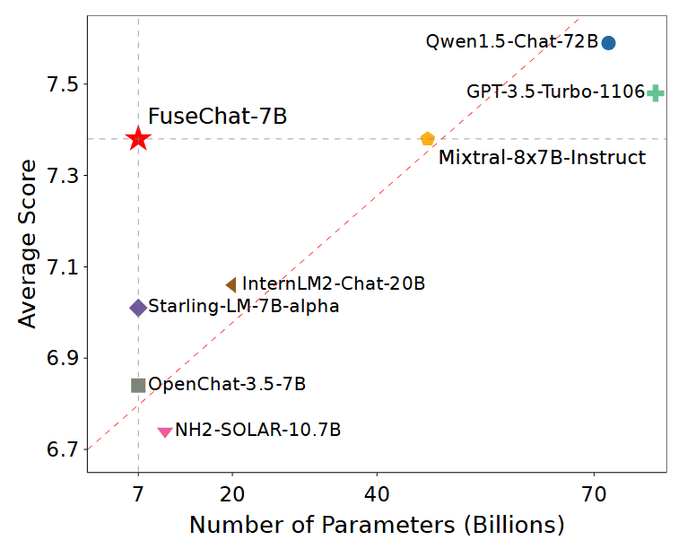

<p align="center" width="100%">
</p>

<div id="top" align="center">

FuseChat: Knowledge Fusion of Chat Models
-----------------------------
 


<h4> |<a href="https://arxiv.org/abs/2408.07990"> 📑 Paper </a> |
<a href="https://huggingface.co/FuseAI"> 🤗 HuggingFace Repo </a> |
<a href="https://github.com/fanqiwan/FuseLLM"> 🐱 GitHub Repo </a> |
</h4>

<!-- **Authors:** -->

_**Fanqi Wan, Longguang Zhong, Ziyi Yang, Ruijun Chen, Xiaojun Quan**_


<!-- **Affiliations:** -->


_Sun Yat-sen University_

<p align="center">
     <br>
</p>


</div>


## News
- **Aug 16, 2024:** 🔥🔥🔥 We update the [FuseChat tech report](https://arxiv.org/abs/2408.07990) and release [FuseChat-7B-v2.0](https://huggingface.co/FuseAI/FuseChat-7B-v2.0), which is the fusion of six prominent chat LLMs with diverse architectures and scales, namely [OpenChat-3.5-7B](https://huggingface.co/openchat/openchat_3.5), [Starling-LM-7B-alpha](https://huggingface.co/berkeley-nest/Starling-LM-7B-alpha), [NH2-Solar-10.7B](https://huggingface.co/NousResearch/Nous-Hermes-2-SOLAR-10.7B), [InternLM2-Chat-20B](https://huggingface.co/internlm/internlm2-chat-20b), [Mixtral-8x7B-Instruct](https://huggingface.co/mistralai/Mixtral-8x7B-Instruct-v0.1), and [Qwen1.5-Chat-72B](https://huggingface.co/Qwen/Qwen1.5-72B-Chat). FuseChat-7B-v2.0 achieves an average performance of **7.38** on MT-Bench (GPT-4-0125-Preview as judge LLM), which is comparable to [Mixtral-8x7B-Instruct](https://huggingface.co/mistralai/Mixtral-8x7B-Instruct-v0.1) and approaches [GPT-3.5-Turbo-1106](https://platform.openai.com/docs/models/gpt-3-5-turbo).  

- **Feb 26, 2024:** 🔥🔥 We release [FuseChat-7B-VaRM](https://huggingface.co/FuseAI/FuseChat-7B-VaRM), which is the fusion of three prominent chat LLMs with diverse architectures and scales, namely [NH2-Mixtral-8x7B](https://huggingface.co/NousResearch/Nous-Hermes-2-Mixtral-8x7B-DPO), [NH2-Solar-10.7B](https://huggingface.co/NousResearch/Nous-Hermes-2-SOLAR-10.7B), and [OpenChat-3.5-7B](https://huggingface.co/openchat/openchat_3.5). FuseChat-7B-VaRM achieves an average performance of **8.22** on MT-Bench (GPT-4-1106-Preview as judge LLM), outperforming various powerful chat LLMs at 7B and 34B scales like [Starling-7B](https://huggingface.co/berkeley-nest/Starling-LM-7B-alpha) and [Yi-34B-Chat](https://huggingface.co/01-ai/Yi-34B-Chat), even surpassing [GPT-3.5 (March)](https://platform.openai.com/docs/models/gpt-3-5-turbo), [Claude-2.1](https://www.anthropic.com/news/claude-2-1), and approaching [Mixtral-8x7B-Instruct](https://huggingface.co/mistralai/Mixtral-8x7B-Instruct-v0.1). 

- **Feb 25, 2024:** 🔥 We release [FuseChat-Mixture](https://huggingface.co/datasets/FuseAI/FuseChat-Mixture), which is a comprehensive training dataset covers different styles and capabilities, featuring both human-written and model-generated, and spanning general instruction-following and specific skills.

- **Aug 16, 2024:** 🔥 We release [FuseChat-7B-v2.0](https://huggingface.co/FuseAI/FuseChat-7B-v2.0), which is the fusion of six prominent chat LLMs with diverse architectures and scales, namely [OpenChat-3.5-7B](https://huggingface.co/openchat/openchat_3.5), [Starling-LM-7B-alpha](https://huggingface.co/berkeley-nest/Starling-LM-7B-alpha), [NH2-Solar-10.7B](https://huggingface.co/NousResearch/Nous-Hermes-2-SOLAR-10.7B), [InternLM2-Chat-20B](https://huggingface.co/internlm/internlm2-chat-20b), [Mixtral-8x7B-Instruct](https://huggingface.co/mistralai/Mixtral-8x7B-Instruct-v0.1), and [Qwen1.5-Chat-72B](https://huggingface.co/Qwen/Qwen1.5-72B-Chat). FuseChat-7B-v2.0 achieves an average performance of **7.38** on MT-Bench(GPT4-0125-preview), which is comparable to [Mixtral-8x7B-Instruct](https://huggingface.co/mistralai/Mixtral-8x7B-Instruct-v0.1) and approaches [GPT-3.5-Turbo-1106](https://platform.openai.com/docs/models/gpt-3-5-turbo). 

## Contents

- [Overview](#overview)
- [Model Release](#model-release)
- [Quick Start](#quick-start)
- [Supported Models](#supported-models)
- [Experiment Preparation](#experiment-preparation)
- [Data Construction](#data-construction)
- [Pairwise Knowledge Fusion](#pairwise-knowledge-fusion)
- [Model Merging](#model-merging)
- [Evaluation](#evaluation)
- [Citation](#citation)

## Overview
 
In this work, we propose an extended framework of FuseLLM to integrate the collective knowledge and individual strengths of multiple structure and scale-varied chat LLMs into a more powerful chat LLM, resulting in FuseChat. FuseChat adopts a fuse-then-merge strategy with two main stages. Firstly, it undertakes pairwise knowledge fusion for source LLMs to derive multiple target LLMs of identical structure and size via lightweight fine-tuning. Then, these target LLMs are merged within the parameter space, wherein we propose a novel method VaRM for determining the merging weights based on the variation ratio of parameter matrices before and after fine-tuning. 


Moreover, we argue that the concept of knowledge fusion adopted by both FuseChat and FuseLLM shares a fundamentally similar purpose with other related topics, such as the recently popular topic of mixture of experts (MoEs), because they all aim to leverage the strengths of multiple models (experts). However, while MoEs require loading multiple experts during inference, which has higher memory requirements, knowledge fusion supports the integration of multiple LLMs with diverse architectures into a single LLM without any additional memory requirement, making it more memory-efficient. 

<p align="center">
     <br>
</p>


## Model Release

We release [FuseChat-7B-v2.0](https://huggingface.co/FuseAI/FuseChat-7B-v2.0), which is the fusion of six prominent chat LLMs with diverse architectures and scales, namely [OpenChat-3.5-7B](https://huggingface.co/openchat/openchat_3.5), [Starling-LM-7B-alpha](https://huggingface.co/berkeley-nest/Starling-LM-7B-alpha), [NH2-Solar-10.7B](https://huggingface.co/NousResearch/Nous-Hermes-2-SOLAR-10.7B), [InternLM2-Chat-20B](https://huggingface.co/internlm/internlm2-chat-20b), [Mixtral-8x7B-Instruct](https://huggingface.co/mistralai/Mixtral-8x7B-Instruct-v0.1), and [Qwen1.5-Chat-72B](https://huggingface.co/Qwen/Qwen1.5-72B-Chat). FuseChat-7B-v2.0 achieves an average performance of **7.38** on MT-Bench (GPT-4-0125-Preview as judge LLM), which is comparable to [Mixtral-8x7B-Instruct](https://huggingface.co/mistralai/Mixtral-8x7B-Instruct-v0.1) and approaches [GPT-3.5-Turbo-1106](https://platform.openai.com/docs/models/gpt-3-5-turbo). 

To support a plug-and-play fusion of new source LLM, we release our target LLMs: [OpenChat-3.5-7B-Starling-v2.0](https://huggingface.co/FuseAI/OpenChat-3.5-7B-Starling-v2.0), [OpenChat-3.5-7B-SOLAR-v2.0](https://huggingface.co/FuseAI/OpenChat-3.5-7B-SOLAR-v2.0), [OpenChat-3.5-7B-InternLM-v2.0](https://huggingface.co/FuseAI/OpenChat-3.5-7B-InternLM-v2.0), [OpenChat-3.5-7B-Mixtral-v2.0](https://huggingface.co/FuseAI/OpenChat-3.5-7B-Mixtral-v2.0), and [OpenChat-3.5-7B-Qwen-v2.0](https://huggingface.co/FuseAI/OpenChat-3.5-7B-Qwen-v2.0), which are obtained from pair-wise knowledge fusion. Integrating a new source LLM at any scale requires only obtaining a target LLM from the new source LLM and merging it with the existing target LLMs.

Here are the evaluation results.

<p align="center">
     <br>
</p>

## Quick Start

### Setup

We use `python 3.11` in this project.

Then, we have to install all the libraries listed in `requirements.txt`.

```bash
pip install -r requirements.txt
```

### Usage

Here's how you can run the model using the 🤗 Transformers:

```python
import transformers
tokenizer = transformers.AutoTokenizer.from_pretrained("FuseAI/FuseChat-7B-v2.0")
# Single-turn
tokens = tokenizer("GPT4 Correct User: Hello<|end_of_turn|>GPT4 Correct Assistant:").input_ids
assert tokens == [1, 420, 6316, 28781, 3198, 3123, 1247, 28747, 22557, 32000, 420, 6316, 28781, 3198, 3123, 21631, 28747]
# Multi-turn
tokens = tokenizer("GPT4 Correct User: Hello<|end_of_turn|>GPT4 Correct Assistant: Hi<|end_of_turn|>GPT4 Correct User: How are you today?<|end_of_turn|>GPT4 Correct Assistant:").input_ids
assert tokens == [1, 420, 6316, 28781, 3198, 3123, 1247, 28747, 22557, 32000, 420, 6316, 28781, 3198, 3123, 21631, 28747, 15359, 32000, 420, 6316, 28781, 3198, 3123, 1247, 28747, 1602, 460, 368, 3154, 28804, 32000, 420, 6316, 28781, 3198, 3123, 21631, 28747]
```

The GPT4 template is also available as the integrated `tokenizer.chat_template`, which can be used instead of manually specifying the template:

```python
messages = [
    {"role": "user", "content": "Hello"},
    {"role": "assistant", "content": "Hi"},
    {"role": "user", "content": "How are you today?"}
]
tokens = tokenizer.apply_chat_template(messages, add_generation_prompt=True)
assert tokens == [1, 420, 6316, 28781, 3198, 3123, 1247, 28747, 22557, 32000, 420, 6316, 28781, 3198, 3123, 21631, 28747, 15359, 32000, 420, 6316, 28781, 3198, 3123, 1247, 28747, 1602, 460, 368, 3154, 28804, 32000, 420, 6316, 28781, 3198, 3123, 21631, 28747]
```
## Supported Models

| Model                                                                                                                       | Model size                       | Chat Template |
|-----------------------------------------------------------------------------------------------------------------------------|----------------------------------|---------------|
| [openchat_3.5](https://huggingface.co/openchat)/[Starling-LM-7B-alpha](https://huggingface.co/berkeley-nest/Starling-LM-7B-alpha) | 7B                               | openchat_3.5  |
| [Mistral/Mixtral](https://huggingface.co/mistralai)                                                                         | 7B/8x7B/8x22B                    | mistral       |
| [Llama 3/Llama 3.1](https://huggingface.co/meta-llama)                                                                      | 8B/70B                           | llama-3       |
| [Gemma/Gemma 2/CodeGemma](https://huggingface.co/google)                                                                    | 2B/7B/9B/27B                     | gemma         |
| [Phi-3](https://huggingface.co/microsoft)                                                                                   | 4B/7B/14B                        | phi-3         |
| [Qwen1.5/Qwen2](https://huggingface.co/Qwen)                                                                 | 0.5B/1.5B/4B/7B/14B/32B/72B/110B | qwen          |
| [InternLM2/InternLM2.5](https://huggingface.co/internlm)                                                                    | 7B/20B                           | internlm2     |
| [Yi/Yi-1.5](https://huggingface.co/01-ai)                                                                                   | 6B/9B/34B                        | yi            |


To support a new model in FuseChat, you'll need to follow these steps:

1. Implement a conversation template for the new model at [conversation.py](FuseChat/train/conversation.py). You can follow existing examples and use `register_conv_template` to add a new one.
2. Implement a model adapter for the new model at [model/model_adapter.py](FuseChat/train/model/model_adapter.py). You can follow existing examples and use `register_model_adapter` to add a new one.
3. Modify the `preprocess()` Function in [train.py](FuseChat/train/train.py).


## Experiment Preparation

### Source LLMs

We conduct experiments using six representative chat LLMs as the source LLMs, including [OpenChat-3.5-7B](https://huggingface.co/openchat/openchat_3.5), [Starling-LM-7B-alpha](https://huggingface.co/berkeley-nest/Starling-LM-7B-alpha), [NH2-SOLAR-10.7B](https://huggingface.co/NousResearch/Nous-Hermes-2-SOLAR-10.7B), [InternLM2-Chat-20B](https://huggingface.co/bartowski/internlm2-chat-20b-llama-old), [Mixtral-8x7B-Instruct](https://huggingface.co/mistralai/Mixtral-8x7B-Instruct-v0.1), [Qwen-1.5-Chat-72B](https://huggingface.co/Qwen/Qwen1.5-72B-Chat). As for the pivot LLM, which also serves as the starting point for the target LLMs, we opt for [OpenChat-3.5-7B](https://huggingface.co/openchat/openchat_3.5) due to its balanced scale and performance. You should download all these models and place them into `/models` before experiments.

### Training Dataset

We curated a comprehensive training dataset, [FuseChat-Mixture](https://huggingface.co/datasets/FuseAI/FuseChat-Mixture), from various sources. This dataset covers different styles and capabilities, featuring both human-written and model-generated, and spanning general instruction-following and specific skills. You should download the dataset and place it into `data/fusechat_v1_clean_split_2048_filter_wrong.json` before experiments.

## Data Construction

Here we show the scripts to obtain representations from multiple source LLMs for model fusion with the following three steps.

### 1. Get Representations

Here we show the scripts to obtain representations from multiple source LLMs.

```bash
# We split the dataset into 4 splits, then process each split on one or multiple GPUs.
# OpenChat-3.5-7B Starling-LM-7B-alpha Nous-Hermes-2-SOLAR-10.7B internlm2-chat-20b Mixtral-8x7B-Instruct-v0.1 Qwen1.5-72B-Chat
export CUDA_VISIBLE_DEVICES=0 # specify one or multiple GPUs
PROJ_PATH=FuseChat # specify your own project path
DATA_NAME="fusechat_v1_clean_split_2048_filter_wrong" 
MODEL_NAME=openchat_3.5 # model to get representation
CONV_TEMP=openchat_3.5 # conversation template, should be the same for all models, see more template names in train/conversation.py

for i in {0..3}; do
python ${PROJ_PATH}/train/get_data_representation.py \
  --model_name_or_path ${PROJ_PATH}/models/${MODEL_NAME} \
  --data_path ${PROJ_PATH}/data/${DATA_NAME}.json \
  --dataset_save_dir ${PROJ_PATH}/representations/${MODEL_NAME}_representation_split${i} \
  --tknz_dataset_path ${PROJ_PATH}/representations/${MODEL_NAME}_representation_tknz_split${i} \
  --cache_dir ${PROJ_PATH}/.cache/huggingface/datasets \
  --model_max_length 2048 \
  --load_in_half bf16 \
  --batch_size 32 \
  --top_k_logits 10 \
  --save_per_token_metric \
  --no_assert \
  --conv_temp ${CONV_TEMP} \
  --mask_instruction \
  --dataset_split_num 4 \
  --dataset_index ${i} \
  --get_representation \
  --device_map "auto"
done
```

### 2. Align Representations

Here we show the scripts to align representations from different source LLMs to pivot LLM.

For source LLMs share the **same vocab** as pivot LLM, we only merge their representations into a single dataset.

```bash
# Pivot LLM:OpenChat-3.5-7B <-> Source LLMs: Starling-LM-7B-alpha Nous-Hermes-2-SOLAR-10.7B Mixtral-8x7B-Instruct-v0.1
PROJ_PATH=FuseChat # specify your own project path
PIVOT_NAME=openchat_3.5  # Pivot LLM
SOURCE_NAME=Starling-LM-7B-alpha # Source LLMs with the same vocab as Pivot

for i in {0..3}; do
python ${PROJ_PATH}/train/replace_model.py \
  --dataset_dir ${PROJ_PATH}/representations/${PIVOT_NAME}_representation_split${i} \
  --replace_dataset_dir ${PROJ_PATH}/representations/${SOURCE_NAME}_representation_split${i} \
  --dataset_save_dir ${PROJ_PATH}/representations/${PIVOT_NAME}_${SOURCE_NAME}_representation_split${i} \
  --preprocessing_num_workers 32 \
  --batch_size 1000 
done
```

For source LLMs have **different vocabs** with pivot LLM, we need to do token alignment and distribution alignment.

```bash
# Pivot LLM:OpenChat-3.5-7B <->Source LLMs: internlm2-chat-20b Qwen1.5-72B-Chat
PROJ_PATH=FuseChat # specify your own project path
PIVOT_NAME=openchat_3.5 # Pivot LLM
SOURCE_NAME=internlm2-chat-20b # Source LLMs have different vocab with Pivot
align_type="default" # different alignment method hard -> EM, soft -> MinED, default -> MS
token_alignment_matrix_file=${PROJ_PATH}/aligned_representations/${PIVOT_NAME}_${SOURCE_NAME}_token_sparse_matrix_${align_type}.npz
blending_to_base_file=${PROJ_PATH}/aligned_representations/${PIVOT_NAME}_${SOURCE_NAME}_token_mapping_${align_type}.json

# token alignment
python ${PROJ_PATH}/train/align_token_and_vocab.py \
  --align_type ${align_type} \
  --base_model_name_or_path ${PROJ_PATH}/models/${PIVOT_NAME} \
  --blending_model_name_or_path ${PROJ_PATH}/models/${SOURCE_NAME} \
  --base_dataset_dir "${PROJ_PATH}/representations/${PIVOT_NAME}_representation_tknz_split0,${PROJ_PATH}/representations/${PIVOT_NAME}_representation_tknz_split1,${PROJ_PATH}/representations/${PIVOT_NAME}_representation_tknz_split2,${PROJ_PATH}/representations/${PIVOT_NAME}_representation_tknz_split3" \
  --blending_dataset_dir "${PROJ_PATH}/representations/${SOURCE_NAME}_representation_tknz_split0,${PROJ_PATH}/representations/${SOURCE_NAME}_representation_tknz_split1,${PROJ_PATH}/representations/${SOURCE_NAME}_representation_tknz_split2,${PROJ_PATH}/representations/${SOURCE_NAME}_representation_tknz_split3" \
  --aligned_dataset_tknz_save_dir ${PROJ_PATH}/aligned_representations/${PIVOT_NAME}_${SOURCE_NAME}_representation_tknz \
  --model_max_length 2048 \
  --preprocessing_num_workers 32 \
  --batch_size 16 \
  --token_alignment_matrix_file ${token_alignment_matrix_file} \
  --blending_to_base_file ${blending_to_base_file} \
  --do_token_alignment \
  --metric_level "sequence" \
  --use_token_alignment_matrix

# distribution alignment
for i in {0..3}; do
python ${PROJ_PATH}/train/align_token_and_vocab.py \
  --align_type ${align_type} \
  --base_model_name_or_path ${PROJ_PATH}/models/${PIVOT_NAME} \
  --blending_model_name_or_path ${PROJ_PATH}/models/${SOURCE_NAME} \
  --base_dataset_dir ${PROJ_PATH}/representations/${PIVOT_NAME}_representation_split${i} \
  --blending_dataset_dir ${PROJ_PATH}/representations/${SOURCE_NAME}_representation_split${i} \
  --aligned_dataset_save_dir ${PROJ_PATH}/aligned_representations/${PIVOT_NAME}_${SOURCE_NAME}_representation_split${i} \
  --model_max_length 2048 \
  --preprocessing_num_workers 32 \
  --batch_size 16 \
  --temperature 0.5 \
  --token_alignment_matrix_file ${token_alignment_matrix_file} \
  --blending_to_base_file ${blending_to_base_file} \
  --do_distribution_alignment \
  --metric_level "sequence" \
  --use_token_alignment_matrix
done
```

### 3. Filter NaN

Here we show the scripts to filter instance with NaN "metric_ce" in the dataset.

```bash
for i in {0..3}; do
python ${PROJ_PATH}/train/filter_nan.py \
  --input_data_dir ${PROJ_PATH}/aligned_representations/${PIVOT_NAME}_${SOURCE_NAME}_representation_split${i} \
  --output_data_dir ${PROJ_PATH}/aligned_representations/${PIVOT_NAME}_${SOURCE_NAME}_representation_split${i}_fnan \
done
```

The processed representations data are in the following path: 

`${PROJ_PATH}/aligned_representations/${PIVOT_NAME}_${SOURCE_NAME}_representation_split${i}_fnan`

## Pairwise Knowledge Fusion

We show the scripts for pairwise knowledge fusion with the processed representations.

```bash
# OpenChat-3.5-7B <-> Starling-LM-7B-alpha Nous-Hermes-2-SOLAR-10.7B internlm2-chat-20b Mixtral-8x7B-Instruct-v0.1 Qwen1.5-72B-Chat
export CUDA_VISIBLE_DEVICES=0,1,2,3,4,5,6,7
torchrun --nproc_per_node=8 --master_port=20001 ${PROJ_PATH}/train/train.py \
  --model_name_or_path "openchat/openchat_3.5" \
  --data_path "${PROJ_PATH}/aligned_representations/${PIVOT_NAME}_${SOURCE_NAME}_representation_split0_fnan,${PROJ_PATH}/aligned_representations/${PIVOT_NAME}_${SOURCE_NAME}_representation_split1_fnan,${PROJ_PATH}/aligned_representations/${PIVOT_NAME}_${SOURCE_NAME}_representation_split2_fnan,${PROJ_PATH}/aligned_representations/${PIVOT_NAME}_${SOURCE_NAME}_representation_split3_fnan" \
  --bf16 True \
  --output_dir "${PROJ_PATH}/checkpoints/${PIVOT_NAME}_${SOURCE_NAME}_pairwise_fusion_ckpt" \
  --num_train_epochs 3 \
  --per_device_train_batch_size 4 \
  --per_device_eval_batch_size 4 \
  --gradient_accumulation_steps 4 \
  --evaluation_strategy "no" \
  --save_strategy "epoch" \
  --save_steps 10000 \
  --save_total_limit 5 \
  --learning_rate 5e-6 \
  --weight_decay 0. \
  --warmup_ratio 0.03 \
  --lr_scheduler_type "cosine" \
  --logging_steps 1 \
  --fsdp "full_shard auto_wrap" \
  --fsdp_transformer_layer_cls_to_wrap 'MistralDecoderLayer' \
  --tf32 True \
  --model_max_length 2048 \
  --gradient_checkpointing True \
  --conv_temp "openchat_3.5" \
  --lazy_preprocess True \
  --flash_attn_transformers True \
  --do_train \
  --do_fuse \
  --fuse_with_ref_model True \
  --fuse_loss_type "ce" \
  --fuse_temperature 1.0 \
  --lm_loss_weight 0.9 \
  --dataloader_num_workers 8 \
  --remove_unused_columns False
```

## Model Merging

We show the scripts on how to get FuseChat from target LLMs using different merging methods.

Before merging, please install our modified ["mergekit"](https://github.com/arcee-ai/mergekit).

```bash
cd mergekit
pip install -e .
```

### Our SCE method

The implementation of our method is in `mergekit/mergekit/merge_methods/sce_merging.py`.

```bash
model_save_dir=xx # specify your path to save the merged models
mergekit-yaml mergekit/fusechat_configs/fusechat-sce.yml ${model_save_dir}/FuseChat-7B-SCE
```

### Other merging methods

```bash
model_save_dir=xx # your path to save the merged models
mergekit-yaml mergekit/fusechat_configs/fusechat-linear.yml ${model_save_dir}/FuseChat-7B-LINEAR

mergekit-yaml mergekit/fusechat_configs/fusechat-ta.yml ${model_save_dir}/FuseChat-7B-TA

mergekit-yaml mergekit/fusechat_configs/fusechat-ties.yml ${model_save_dir}/FuseChat-7B-TIES

mergekit-yaml mergekit/fusechat_configs/fusechat-dare.yml ${model_save_dir}/FuseChat-7B-DARE
```


## Evaluation

We conduct experiments on two representative benchmarks named AlpacaEval 2.0 and MT-Bench to evaluate the instruction-following and multi-turn conversation capabilities.

### MT-Bench

MT-Bench comprises 80 multi-turn dialogues spanning writing, roleplay, reasoning, math, coding, stem, and humanities domains.The original benchmark uses GPT-4-0613 as the evaluator to provide a scalar score ranging from 1 (lowest) to 10 (highest) for the generated responses. However, due to inaccuracies in the reference responses generated by the old GPT-4-0613, we follow [the latest works](https://github.com/lm-sys/FastChat/pull/3158) to adopt an updated GPT-4-0125-Preview to correct these errors and evaluate the generated responses.

Please download the [official code](https://github.com/lm-sys/FastChat/tree/main/fastchat/llm_judge) and follow the guidelines for evaluation. To use GPT-4-0125-Preview as judge model, you should download [gpt-4-0125-preview.jsonl](https://github.com/lm-sys/FastChat/pull/3158/files), and place it in `llm_judge/data/mt_bench/reference_answer`. Then, add "gpt-4-0125-preview" as a valid judge model in `common.py`.

```bash
# Step 1. Generate model answers to MT-bench questions
export CUDA_VISIBLE_DEVICES=0,1
python gen_model_answer.py \
  --model-path "FuseChat-7B-v2.0" \
  --model-id "openchat_3.5_fusechat_7b_sce" \
  --num-gpus-per-model 1 \
  --num-gpus-total 2

# Step 2. Generate GPT-4-0125-Preview judgments
export OPENAI_API_KEY=XXXXXX  # set the OpenAI API key
python gen_judgment.py \
  --model-list "openchat_3.5_fusechat_7b_sce" \
  --judge-model "gpt-4-0125-preview" \
  --parallel 8

# Step 3. Show MT-bench scores
python show_result.py --model-list "openchat_3.5_fusechat_7b_sce" 
```

### AlpacaEval 2.0

AlpacaEval 2.0, contains 805 instructions from five test subsets. This benchmark compares the Win Rate and Length-Controlled Win Rate (LC Win Rate) against GPT-4. 
We follow the default settings to employ GPT-4-1106-Preview to assess the quality of generated responses. 

Please download the [official code](https://github.com/tatsu-lab/alpaca_eval) and follow the guidelines. We use the default `alpaca_eval_gpt4_turbo_fn` for evaluation. The prompt for generation is:

```
GPT4 Correct User: {instruction}<|end_of_turn|>GPT4 Correct Assistant: 
```

## Citation

If you find this work is relevant with your research or applications, please feel free to cite our work!
```
@article{wan2024fusechat,
  title={FuseChat: Knowledge Fusion of Chat Models},
  author={Fanqi Wan and Longguang Zhong and Ziyi Yang and Ruijun Chen and Xiaojun Quan},
  journal={arXiv preprint arXiv:2408.07990},
  year={2024}
}
```
