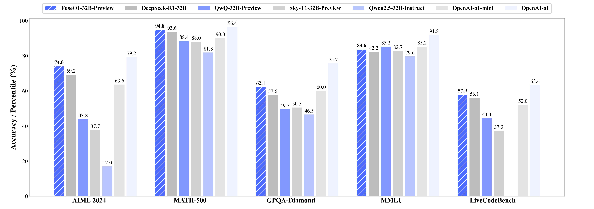

<p align="center" width="100%">
</p>

<div id="top" align="center">

FuseO1-Preview: System-II Reasoning Fusion of LLMs
-----------------------------

<h4> |<a href="https://arxiv.org/abs/2408.07990"> 📑 Paper </a> |
<a href="https://github.com/fanqiwan/FuseAI"> 🐱 GitHub Repo </a> |
<a href="https://huggingface.co/FuseAI"> 🤗 Hugging Face </a> |
<a href="https://huggingface.co/blog/Wanfq/fuseo1-preview"> 🌐 Blog </a> |
</h4>

<!-- **Authors:** -->

_Fanqi Wan, Longguang Zhong, Ziyi Yang, Weizhou Shen, Xinting Huang_


<!-- **Affiliations:** -->

_FuseAI Team_

</div>

<p align="center">
     <br>
</p>


## Overview

[FuseO1-Preview](https://huggingface.co/collections/FuseAI/fuseo1-preview-678eb56093649b2688bc9977) is our initial endeavor to enhance the System-II reasoning capabilities of large language models (LLMs) through innovative model fusion techniques. By employing our advanced [SCE](https://arxiv.org/abs/2408.07990) merging methodologies, we integrate multiple open-source o1-like LLMs into a unified model. Our goal is to incorporate the distinct knowledge and strengths from different reasoning LLMs into a single, unified model with strong System-II reasoning abilities, particularly in mathematics, coding, and science domains.

<p align="center">
     <br>
</p>

To achieve this, we conduct two types of model merging:

- **Long-Long Reasoning Merging**: This approach involves model fusion across LLMs that utilize long-CoT reasoning, with the goal of enhancing long-CoT reasoning capabilities. The resulted [FuseAI/FuseO1-DeepSeekR1-QwQ-SkyT1-32B-Preview](https://huggingface.co/FuseAI/FuseO1-DeepSeekR1-QwQ-SkyT1-32B-Preview) achieves a Pass@1 accuracy of **74.0 on AIME24**,  demonstrating significant performance improvements compared to the OpenAI o1-preview (44.6) and OpenAI o1-mini (63.4), even approaching OpenAI o1 (79.2).
- **Long-Short Reasoning Merging**: This approach involves model fusion between long-CoT and short-CoT LLMs, aiming to improve reasoning capabilities in both long and short reasoning processes. The resulted [FuseAI/FuseO1-DeepSeekR1-Qwen2.5-Instruct-32B-Preview](https://huggingface.co/FuseAI/FuseO1-DeepSeekR1-Qwen2.5-Instruct-32B-Preview) is capable of utilizing both long and short reasoning processes and demonstrates relatively strong performance in long reasoning tasks.

| Model | Merge Type | Source Models | HF Link |
|:----- | ---- | ---- | ---- |
| [FuseAI/FuseO1-DeepSeekR1-QwQ-SkyT1-32B-Preview](https://huggingface.co/FuseAI/FuseO1-DeepSeekR1-QwQ-SkyT1-32B-Preview) | Long-Long Reasoning Merge | [deepseek-ai/DeepSeek-R1-Distill-Qwen-32B](https://huggingface.co/deepseek-ai/DeepSeek-R1-Distill-Qwen-32B), [Qwen/QwQ-32B-Preview](https://huggingface.co/Qwen/QwQ-32B-Preview), [NovaSky-AI/Sky-T1-32B-Preview](https://huggingface.co/NovaSky-AI/Sky-T1-32B-Preview) | [🤗 Hugging Face](https://huggingface.co/FuseAI/FuseO1-DeepSeekR1-QwQ-SkyT1-32B-Preview), [GGUF](https://huggingface.co/FuseAI/FuseO1-DeepSeekR1-QwQ-SkyT1-32B-Preview-GGUF) |
| [FuseAI/FuseO1-DeepSeekR1-QwQ-32B-Preview](https://huggingface.co/FuseAI/FuseO1-DeepSeekR1-QwQ-32B-Preview) | Long-Long Reasoning Merge | [deepseek-ai/DeepSeek-R1-Distill-Qwen-32B](https://huggingface.co/deepseek-ai/DeepSeek-R1-Distill-Qwen-32B), [Qwen/QwQ-32B-Preview](https://huggingface.co/Qwen/QwQ-32B-Preview)  | [🤗 Hugging Face](https://huggingface.co/FuseAI/FuseO1-DeepSeekR1-QwQ-32B-Preview) |
| [FuseAI/FuseO1-DeepSeekR1-Qwen2.5-Instruct-32B-Preview](https://huggingface.co/FuseAI/FuseO1-DeepSeekR1-Qwen2.5-Instruct-32B-Preview) | Long-Short Reasoning Merge | [deepseek-ai/DeepSeek-R1-Distill-Qwen-32B](https://huggingface.co/deepseek-ai/DeepSeek-R1-Distill-Qwen-32B), [Qwen/Qwen2.5-32B-Instruct](https://huggingface.co/Qwen/Qwen2.5-32B-Instruct) | [🤗 Hugging Face](https://huggingface.co/FuseAI/FuseO1-DeepSeekR1-Qwen2.5-Instruct-32B-Preview) |
| [FuseAI/FuseO1-DeepSeekR1-Qwen2.5-Coder-32B-Preview](https://huggingface.co/FuseAI/FuseO1-DeepSeekR1-Qwen2.5-Coder-32B-Preview) | Long-Short Reasoning Merge | [deepseek-ai/DeepSeek-R1-Distill-Qwen-32B](https://huggingface.co/deepseek-ai/DeepSeek-R1-Distill-Qwen-32B), [Qwen/Qwen2.5-32B-Coder](https://huggingface.co/Qwen/Qwen2.5-32B-Coder) | [🤗 Hugging Face](https://huggingface.co/FuseAI/FuseO1-DeepSeekR1-Qwen2.5-Coder-32B-Preview) |


## Long-Long Reasoning Merging

We conduct experiments on these folloing long-cot LLMs.

- [deepseek-ai/DeepSeek-R1-Distill-Qwen-32B](https://huggingface.co/deepseek-ai/DeepSeek-R1-Distill-Qwen-32B)
- [Qwen/QwQ-32B-Preview](https://huggingface.co/Qwen/QwQ-32B-Preview)
- [NovaSky-AI/Sky-T1-32B-Preview](https://huggingface.co/NovaSky-AI/Sky-T1-32B-Preview)

To reproduce the merged [FuseAI/FuseO1-DeepSeekR1-QwQ-SkyT1-32B-Preview](https://huggingface.co/FuseAI/FuseO1-DeepSeekR1-QwQ-SkyT1-32B-Preview) model, using the script below.

```sh
cd FuseAI/FuseO1-Preview/mergekit
pip3 install -e .
model_save_dir=xx # your path to save the merged models
mergekit-yaml fuseo1_configs/FuseO1-DeepSeekR1-QwQ-SkyT1-32B-Preview.yaml ${model_save_dir}/FuseO1-DeepSeekR1-QwQ-SkyT1-32B-Preview --cudas
```

To reproduce the merged [FuseAI/FuseO1-DeepSeekR1-QwQ-32B-Preview](https://huggingface.co/FuseAI/FuseO1-DeepSeekR1-QwQ-32B-Preview) model, using the script below.

```sh
cd FuseAI/FuseO1-Preview/mergekit
pip3 install -e .
model_save_dir=xxx # your path to save the merged models
mergekit-yaml fuseo1_configs/FuseO1-DeepSeekR1-QwQ-32B-Preview.yaml ${model_save_dir}/FuseO1-DeepSeekR1-QwQ-32B-Preview --cuda
```

We provide the example code to use FuseAI/FuseO1-DeepSeekR1-QwQ-SkyT1-32B-Preview.

```python3
from vllm import LLM, SamplingParams

llm = LLM(model="FuseAI/FuseO1-DeepSeekR1-QwQ-SkyT1-32B-Preview", tensor_parallel_size=8)
sampling_params = SamplingParams(max_tokens=32768, temperature=0.7, stop=["<|im_end|>", "<｜end▁of▁sentence｜>"], stop_token_ids=[151645, 151643])

conversations = [
    [
        {"role": "system", "content": "Please reason step by step, and put your final answer within \\boxed{{}}."},
        {"role": "user", "content": "Quadratic polynomials $P(x)$ and $Q(x)$ have leading coefficients $2$ and $-2,$ respectively. The graphs of both polynomials pass through the two points $(16,54)$ and $(20,53).$ Find $P(0) + Q(0).$."},
    ],
]

responses = llm.chat(messages=conversations, sampling_params=sampling_params, use_tqdm=True)

for response in responses:
    print(response.outputs[0].text.strip())
```

## Long-Short Reasoning Merging

We conduct experiments on these folloing long-cot and short-cot LLMs.

- [deepseek-ai/DeepSeek-R1-Distill-Qwen-32B](https://huggingface.co/deepseek-ai/DeepSeek-R1-Distill-Qwen-32B)
- [Qwen/Qwen2.5-32B-Instruct](https://huggingface.co/Qwen/Qwen2.5-32B-Instruct)
- [Qwen/Qwen2.5-32B-Coder](https://huggingface.co/Qwen/Qwen2.5-32B-Coder)

To reproduce the merged [FuseAI/FuseO1-DeepSeekR1-Qwen2.5-Instruct-32B-Preview](https://huggingface.co/FuseAI/FuseO1-DeepSeekR1-Qwen2.5-Instruct-32B-Preview) model, using the script below.

```sh
cd FuseAI/FuseO1-Preview/mergekit
pip3 install -e .
model_save_dir=xxx # your path to save the merged models
mergekit-yaml fuseo1_configs/FuseO1-DeepSeekR1-Qwen2.5-Instruct-32B-Preview.yaml ${model_save_dir}/FuseO1-DeepSeekR1-Qwen2.5-Instruct-32B-Preview --cuda
```

To reproduce the merged [FuseAI/FuseO1-DeepSeekR1-Qwen2.5-Coder-32B-Preview](https://huggingface.co/FuseAI/FuseO1-DeepSeekR1-Qwen2.5-Coder-32B-Preview) model, using the script below.

```sh
cd FuseAI/FuseO1-Preview/mergekit
pip3 install -e .
model_save_dir=xxx # your path to save the merged models
mergekit-yaml fuseo1_configs/FuseO1-DeepSeekR1-Qwen2.5-Coder-32B-Preview.yaml ${model_save_dir}/FuseO1-DeepSeekR1-Qwen2.5-Coder-32B-Preview --cuda
```

We provide the code to use FuseAI/FuseO1-DeepSeekR1-Qwen2.5-Instruct-32B-Preview.

```python3
from vllm import LLM, SamplingParams

llm = LLM(model="FuseAI/FuseO1-DeepSeekR1-Qwen2.5-Instruct-32B-Preview", tensor_parallel_size=8)
sampling_params = SamplingParams(max_tokens=32768, temperature=0.7, stop=["<|im_end|>", "<｜end▁of▁sentence｜>"], stop_token_ids=[151645, 151643])

conversations = [
    [
        {"role": "system", "content": "Please reason step by step, and put your final answer within \\boxed{{}}."},
        {"role": "user", "content": "Quadratic polynomials $P(x)$ and $Q(x)$ have leading coefficients $2$ and $-2,$ respectively. The graphs of both polynomials pass through the two points $(16,54)$ and $(20,53).$ Find $P(0) + Q(0).$."},
    ],
]

responses = llm.chat(messages=conversations, sampling_params=sampling_params, use_tqdm=True)

for response in responses:
    print(response.outputs[0].text.strip())
```

## Evaluation Results

We test the resulted models on three kinds of benchmarks, including **Math Reasoning**, **Code Reasoning** , and **Scientific Reasoning**.

Math Reasoning
  - AIME24
  - MATH500
  - OlympiadBench

Scientific Reasoning
  - GPQA-Diamond
  - MMLU-Pro
  - MMLU
  

Code Reasoning
  - LiveCodeBench (2408-2502)

> Important Note: We manully set `"add_bos_token": false` in `tokenizer_config.json` for all the evaluated LLMs to prevent the bos_token to be added twice for each prompt. Please download and modify to ensure consistency.

### Math Reasoning

The evaluation code is modified from [Qwen2.5-Math](https://github.com/QwenLM/Qwen2.5-Math). In our evaluation, we set the temperature to 0.6, the top-p to 0.95 and the max_tokens to 32768. We provide the example to reproduce our results in [math_evaluation](https://github.com/fanqiwan/FuseAI/tree/main/FuseO1-Preview/math_evaluation).

The system prompt for evaluation is set to:

```sh
Please reason step by step, and put your final answer within \\boxed{{}}.
```

The evaluation results are shown in the table below:

In our evaluation of AIME24, we follow the method from DeepSeek-R1, wherein Pass@1 is computed by averaging the results across 32 sampled responses per prompt, while Cons@32 is determined through self-consistency analysis of the same 64 sampled responses for each prompt. For other benchmarks, we only sample 1 response and report the Pass@1.

| Models | AIME24 Pass@1 | AIME24 Cons@32 | MATH500 | OlympiadBench |
|:------ | --------------| ------------------- | ------------ | -------------- |
| OpenAI o1 | 79.2 | - | 96.4 | - |
| OpenAI o1-preview | 44.6 | - | 85.5 | - |
| OpenAI o1-mini | 63.6 | - | 90.0 | - |
| DeepSeek R1 | 79.8 | - | 97.3 | - |
| [deepseek-ai/DeepSeek-R1-Distill-Qwen-32B](https://huggingface.co/deepseek-ai/DeepSeek-R1-Distill-Qwen-32B) | 69.2 | 83.3 | 93.6 | 64.3 |
| [Qwen/QwQ-32B-Preview](https://huggingface.co/Qwen/QwQ-32B-Preview) | 43.8 | 56.7 | 88.4 | 60.3 |
| [NovaSky-AI/Sky-T1-32B-Preview](https://huggingface.co/NovaSky-AI/Sky-T1-32B-Preview) | 37.7 | 50.0 | 88.0 | - |
| [Qwen/Qwen2.5-32B-Instruct](https://huggingface.co/Qwen/Qwen2.5-32B-Instruct) | 17.0 | 20.0 | 81.8 | 48.1 |
| [FuseAI/FuseO1-DeepSeekR1-Qwen2.5-Instruct-32B-Preview](https://huggingface.co/FuseAI/FuseO1-DeepSeekR1-Qwen2.5-Instruct-32B-Preview) | 68.6 | 83.3 | 94.6 | 64.9 |
| [FuseAI/FuseO1-DeepSeekR1-QwQ-32B-Preview](https://huggingface.co/FuseAI/FuseO1-DeepSeekR1-QwQ-32B-Preview) | 69.7 | 83.3 | 94.6 | 64.0 |
| [FuseAI/FuseO1-DeepSeekR1-QwQ-SkyT1-32B-Preview](https://huggingface.co/FuseAI/FuseO1-DeepSeekR1-QwQ-SkyT1-32B-Preview) | 74.0 | 86.7 | 94.8 | 65.0 |

We show that our merged FuseO1-DeepSeekR1-QwQ-SkyT1-32B-Preview demonstrate superior performance improvements comparet to DeepSeek-R1-Distill-Qwen-32B, QwQ-32B-Preview, and Sky-T1-32B-Preview on math reasoning. Specifically, our model achieves an accuracy of **74.0 Pass@1 and 86.7 Cons@32 on AIME24**,  demonstrating significant performance improvements compared to DeepSeek-R1-Distill-Qwen-32B (69.2 Pass@1 and 83.3 Cons@32), OpenAI o1-preview (44.6 Pass@1) and OpenAI o1-mini (63.4 Pass@1), even approaching OpenAI o1 (79.2 Pass@1).

### Scientific Reasoning

The evaluation code is modified from [SkyThought](https://github.com/NovaSky-AI/SkyThought). In our evaluation, we set the temperature to 0.7 and the max_tokens to 32768. We provide the example to reproduce our results in [evaluation](https://github.com/fanqiwan/FuseAI/tree/main/FuseO1-Preview/evaluation).

The system prompt for evaluation is set to:

```sh
You are a helpful and harmless assistant. You should think step-by-step.
```

The evaluation results are shown in the table below:

| Models | GPQA-Diamond| MMLU-Pro | MMLU |
|:------ | --------------| ------------ | -------------- |
| OpenAI o1 | 75.7 | - | 91.8 |
| OpenAI o1-preview | 73.3 | - | 90.8 |
| OpenAI o1-mini | 60.0 | 80.3 | 85.2 |
| DeepSeek R1 | 71.5 | 84.0 | 90.8 |
| [deepseek-ai/DeepSeek-R1-Distill-Qwen-32B](https://huggingface.co/deepseek-ai/DeepSeek-R1-Distill-Qwen-32B) | 57.6 | 68.7 | 82.2 |
| [Qwen/QwQ-32B-Preview](https://huggingface.co/Qwen/QwQ-32B-Preview) | 49.5 | 63.5 | 85.2 |
| [NovaSky-AI/Sky-T1-32B-Preview](https://huggingface.co/NovaSky-AI/Sky-T1-32B-Preview) | 50.5 | 65.8 | 82.7 |
| [Qwen/Qwen2.5-32B-Instruct](https://huggingface.co/Qwen/Qwen2.5-32B-Instruct) | 46.5 | 56.3 | 79.6 |
| [FuseAI/FuseO1-DeepSeekR1-Qwen2.5-Instruct-32B-Preview](https://huggingface.co/FuseAI/FuseO1-DeepSeekR1-Qwen2.5-Instruct-32B-Preview) | 55.1 | 68.6 | 82.0 |
| [FuseAI/FuseO1-DeepSeekR1-QwQ-32B-Preview](https://huggingface.co/FuseAI/FuseO1-DeepSeekR1-QwQ-32B-Preview) | 62.1 | 68.9 | 82.7 |
| [FuseAI/FuseO1-DeepSeekR1-QwQ-SkyT1-32B-Preview](https://huggingface.co/FuseAI/FuseO1-DeepSeekR1-QwQ-SkyT1-32B-Preview) | 62.1 | 70.8 | 83.6 |

We show that our merged FuseO1-DeepSeekR1-QwQ-SkyT1-32B-Preview demonstrate superior performance improvements comparet to DeepSeek-R1-Distill-Qwen-32B, QwQ-32B-Preview, and Sky-T1-32B-Preview on scientific reasoning. Specifically, our model achieves an accuracy of **62.1 on GPQA-Diamond and 70.8 on MMLU-Pro**, demonstrating significant performance improvements compared to DeepSeek-R1-Distill-Qwen-32B (57.6 on GPQA-Diamond and 68.7 on MMLU-Pro).


## Code Reasoning

The evaluation code is modified from [Qwen2.5-Coder](https://github.com/QwenLM/Qwen2.5-Coder/tree/main/qwencoder-eval/reasoning/livecode_bench_cot). In our evaluation, we set the temperature to 0.6, the top-p to 0.95 and the max_tokens to 32768. We provide the example to reproduce our results in [code_evaluation](https://github.com/fanqiwan/FuseAI/tree/main/FuseO1-Preview/code_evaluation).

The system prompt for evaluation is set to:

```sh
A conversation between User and Assistant. The user asks a question, and the Assistant solves it. The assistant first thinks about the reasoning process in the mind and then provides the user with the answer. The reasoning process and answer are enclosed within <think> </think> and <answer> </answer> tags, respectively, i.e., <think> reasoning process here </think> <answer> answer here </answer>.
```

In our evaluation of LiveCodeBench, we follow the method from DeepSeek-R1 and make a slight modification. The Pass@1 is computed by averaging the results across 16 sampled responses per prompt.

The evaluation results are shown in the table below:

| Models | LiveCodeBench | LiveCodeBench-Easy | LiveCodeBench-Medium | LiveCodeBench-Hard |
|:------ | --------------| ------------------- | ------------ | -------------- |
| OpenAI o1 | 63.4 | 98.5 | 80.9 | 31.7 |
| OpenAI o1-preview | 42.7 | 97.0 | 47.2 | 9.8 |
| OpenAI o1-mini | 52.00 | 91.0 | 67.4 | 19.5 |
| DeepSeek R1 | 62.8 | 98.4 | 78.3 | 32.2 |
| [deepseek-ai/DeepSeek-R1-Distill-Qwen-32B](https://huggingface.co/deepseek-ai/DeepSeek-R1-Distill-Qwen-32B) | 56.1 | 93.6 | 73.1 | 23.4 |
| [Qwen/QwQ-32B-Preview](https://huggingface.co/Qwen/QwQ-32B-Preview) | 44.4 | 94.9 | 53.8 | 10.0 |
| [FuseAI/FuseO1-DeepSeekR1-QwQ-SkyT1-32B-Preview](https://huggingface.co/FuseAI/FuseO1-DeepSeekR1-QwQ-SkyT1-32B-Preview) | 57.9 | 93.6 | 76.0 | 25.5 |

We show that our merged FuseO1-DeepSeekR1-QwQ-SkyT1-32B-Preview demonstrate superior performance improvements comparet to DeepSeek-R1-Distill-Qwen-32B, QwQ-32B-Preview, and Sky-T1-32B-Preview on scientific reasoning. Specifically, our model achieves an accuracy of **57.9 on LiveCodeBench and 25.5 on LiveCodeBench-Hard**,  demonstrating significant performance improvements compared to DeepSeek-R1-Distill-Qwen-32B (56.1 on LiveCodeBench and 23.4 on LiveCodeBench-Hard), OpenAI o1-preview (42.7 on LiveCodeBench and 9.8 on LiveCodeBench-Hard) and OpenAI o1-mini (52.0 on LiveCodeBench and 19.5 on LiveCodeBench-Hard Pass@1).

## Future Works

This work is our first attempt effort to achieve knowledge fusion of System-II reasoning LLMs through a model merging approach, which is limited to LLMs with identical scale and architecture. In future work, we plan to employ our [explicit model fusion](https://arxiv.org/abs/2401.10491) method, based on multi-teacher knowledge distillation, and our [implici model fusion](https://arxiv.org/abs/2412.03187) method, which utilizes weighted-reward preference optimization for LLMs with different scales and architectures.
Furthermore, we intend to explore the combination of knowledge fusion with reinforcement learning (RL) methods, which have been demonstrated as the most effective approach for enhancing reasoning abilities. Stay tuned for the next version of FuseO1!

## Citations

```
@article{wan2024fusechat,
  title={Fusechat: Knowledge fusion of chat models},
  author={Wan, Fanqi and Zhong, Longguang and Yang, Ziyi and Chen, Ruijun and Quan, Xiaojun},
  journal={arXiv preprint arXiv:2408.07990},
  year={2024}
}
```