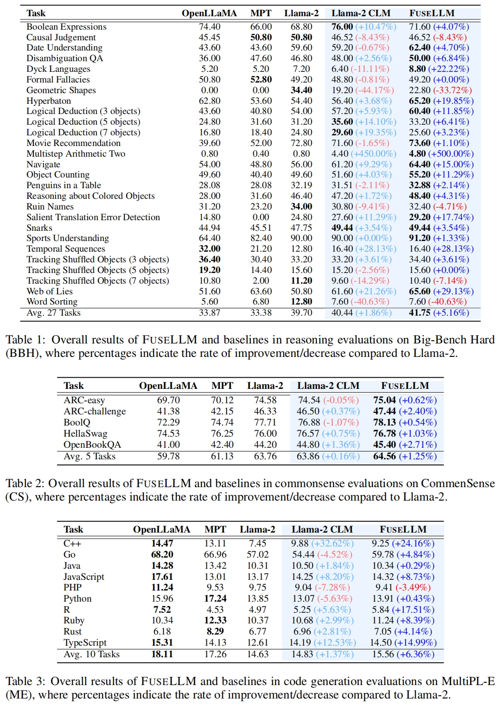
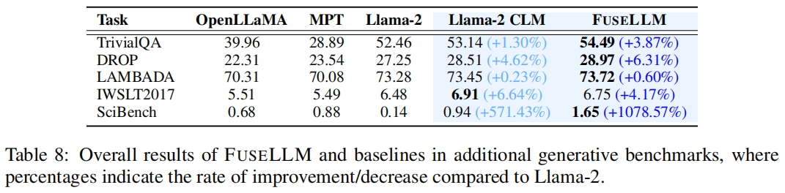

<p align="center" width="100%">
</p>

<div id="top" align="center">

Knowledge Fusion of Large Language Models
-----------------------------

[](https://github.com/tatsu-lab/stanford_alpaca/blob/main/LICENSE)
[](https://github.com/tatsu-lab/stanford_alpaca/blob/main/WEIGHT_DIFF_LICENSE)
[](https://www.python.org/downloads/release/python-390/)
[](https://github.com/psf/black)

<h4> |<a href="https://arxiv.org/abs/xxxx.xxxxx"> 📑 Paper </a> |
<a href="https://huggingface.co/datasets/Wanfq/FuseLLM-7B"> 🤗 Model </a> |
<a href="https://github.com/fanqiwan/FuseLLM"> 🐱 Github Repo </a> |
</h4>

<!-- **Authors:** -->

_**Fanqi Wan<sup>†</sup>, Xinting Huang<sup>‡</sup>, Deng Cai<sup>‡</sup>, Xiaojun Quan<sup>†</sup>, Wei Bi<sup>‡</sup>, Shuming Shi<sup>‡</sup>**_


<!-- **Affiliations:** -->


_<sup>†</sup> Sun Yat-sen University,
<sup>‡</sup> Tencent AI Lab_

</div>


## News
- **Jan 22, 2024:** 🔥 We're excited to announce that the FuseLLM-7B, which is the fusion of [Llama-2-7B](https://huggingface.co/meta-llama/Llama-2-7b-hf), [OpenLLaMA-7B](https://huggingface.co/openlm-research/open_llama_7b_v2), and [MPT-7B](https://huggingface.co/mosaicml/mpt-7b), is now available on 🤗 [Huggingface Models](https://huggingface.co/Wanfq/FuseLLM-7B). Happy exploring!

## Contents

- [Overview](#overview)
- [Model Release](#model-release)
- [License](#license)
- [Citation](#citation)
- [Acknowledgements](#acknowledgments)

## Overview
 
In this study, we explore the realm of knowledge fusion for LLMs to create a unified model that combines the capabilities and distinctive strengths of multiple structurally diverse LLMs. To achieve this, we introduce FuseLLM, which first leverages the generative distributions of these source LLMs to externalize both their collective knowledge and individual strengths, and subsequently transfer them to the target LLM through lightweight continual training.

Compared with model ensemble which requires the parallel deployment of multiple LLMs or weight merging which is generally limited to LLMs with identical architectures, FuseLLM supports the fusion of multiple LLMs with **diverse architectures** by explicitly transferring their knowledge and capabilities to a **single** target LLM.

<p align="center">
     <br>
</p>


## Model Release

We release the FuseLLM-7B on [Huggingface Models](https://huggingface.co/models?sort=trending&search=FuseLLM), which is the fusion of three popular open-source LLMs that possess distinct architectures and functionalities: [Llama-2-7B](https://huggingface.co/meta-llama/Llama-2-7b-hf), [OpenLLaMA-7B](https://huggingface.co/openlm-research/open_llama_7b_v2), and [MPT-7B](https://huggingface.co/mosaicml/mpt-7b).

Evaluations across three benchmarks, which consist of a total of **42** tasks spanning reasoning, commonsense, and code generation, confirm that the target model trained by our method outperforms each source LLM and the casual language model baseline in most tasks.

<p align="center">
     <br>
</p>

To further illustrate the effectiveness of FuseLLM, we incorporate additional generative benchmarks related to knowledge-based question-answering, reading comprehension, content analysis, machine translation, and theorem application. The results highlight FuseLLM’s superiority over all source LLMs and the baseline.

<p align="center">
     <br>
</p>

Since FuseLLM is also applicable to instruction-tuning models,  we assess the instruction-following performance on the Vicuna Benchmark using GPT-4 as an evaluator. The results demonstrate that FuseLLM surpasses each individual source instruction-tuning LLM and the baseline , achieving the best performance with GPT-4 judgment.

<p align="center">
     <br>
</p>


## License

FuseLLM is intended and licensed for research use only. The weights of FuseLLM-7B are CC BY NC 4.0 (allowing only non-commercial use).

## Citation

If you find this work is relevant with your research or applications, please feel free to cite our work!
```
@misc{wan2024knowledge,
   title={Knowledge Fusion of Large Language Models},
   author={Fanqi, Wan and Xinting, Huang and Deng, Cai and Xiaojun, Quan and Wei, Bi and Shuming, Shi},
   year={2024},
   eprint={xxxx.xxxxx},
   archivePrefix={arXiv},
   primaryClass={cs.CL}
}
```

## Acknowledgments

This repo benefits from [Stanford-Alpaca](https://github.com/tatsu-lab/stanford_alpaca) and [Explore-Instruct](https://github.com/fanqiwan/Explore-Instruct). Thanks for their wonderful works!