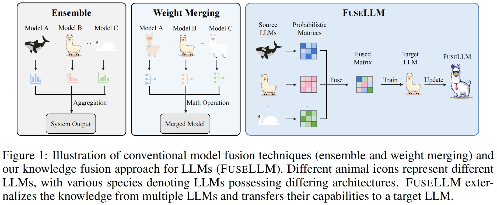
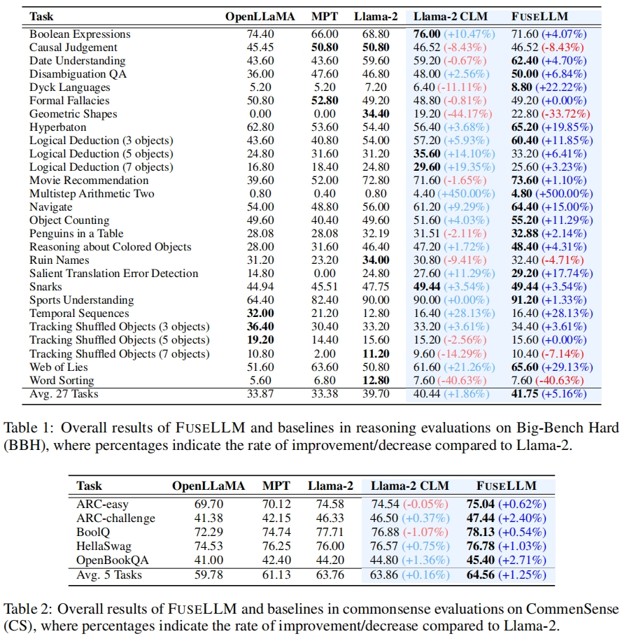
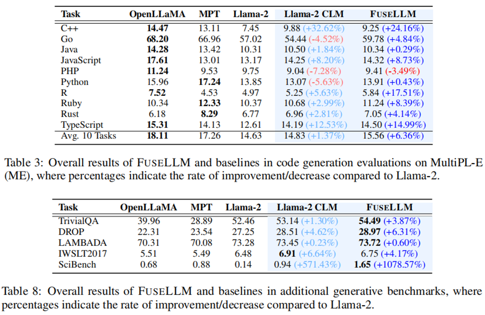
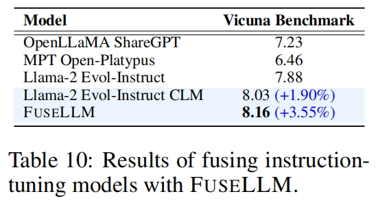
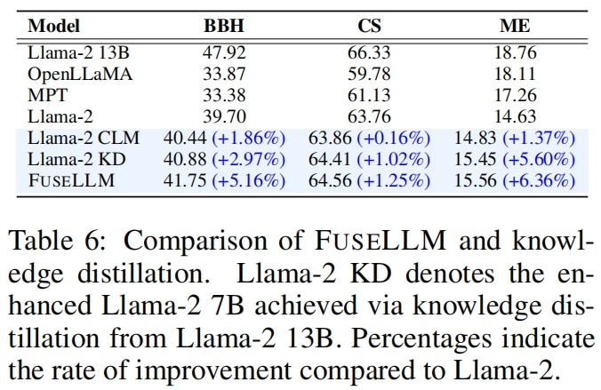
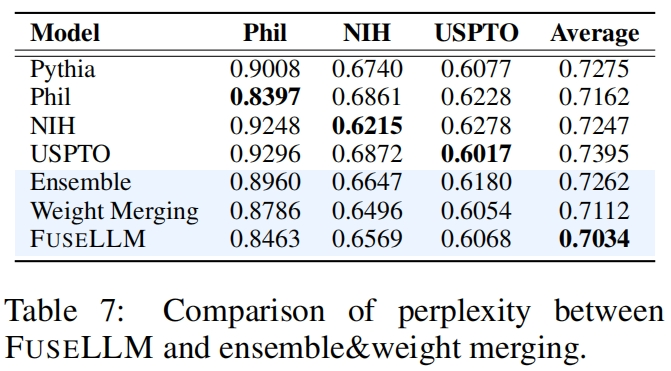

<p align="center" width="100%">
</p>

<div id="top" align="center">

Knowledge Fusion of Large Language Models
-----------------------------
 


<h4> |<a href="https://arxiv.org/abs/2401.10491"> 📑 Paper </a> |
<a href="https://huggingface.co/Wanfq/FuseLLM-7B"> 🤗 Model </a> |
<a href="https://github.com/fanqiwan/FuseLLM"> 🐱 Github Repo </a> |
</h4>

<!-- **Authors:** -->

_**Fanqi Wan<sup>†</sup>, Xinting Huang<sup>‡</sup>, Deng Cai<sup>‡</sup>, Xiaojun Quan<sup>†</sup>, Wei Bi<sup>‡</sup>, Shuming Shi<sup>‡</sup>**_


<!-- **Affiliations:** -->


_<sup>†</sup> Sun Yat-sen University,
<sup>‡</sup> Tencent AI Lab_

</div>


## News
- **Jan 23, 2024:** 🔥🔥 We release the code for FuseLLM, including the data construction and model training process!
- **Jan 22, 2024:** 🔥 We're excited to announce that the FuseLLM-7B, which is the fusion of [Llama-2-7B](https://huggingface.co/meta-llama/Llama-2-7b-hf), [OpenLLaMA-7B](https://huggingface.co/openlm-research/open_llama_7b_v2), and [MPT-7B](https://huggingface.co/mosaicml/mpt-7b), is now available on 🤗 [Huggingface Models](https://huggingface.co/Wanfq/FuseLLM-7B). Happy exploring!

## Contents

- [Overview](#overview)
- [Model Release](#model-release)
- [Quick Start](#quick-start)
- [Citation](#citation)
- [Acknowledgements](#acknowledgments)

## Overview
 
In this study, we explore the realm of knowledge fusion for LLMs to create a unified model that combines the capabilities and distinctive strengths of multiple structurally diverse LLMs. To achieve this, we introduce FuseLLM, which first leverages the generative distributions of these source LLMs to externalize both their collective knowledge and individual strengths, and subsequently transfer them to the target LLM through lightweight continual training.

Unlike model ensemble approaches that require the **parallel deployment of multiple LLMs**, or weight merging techniques that are typically **limited to LLMs with identical architectures**, FuseLLM is designed to support **the fusion of multiple LLMs with diverse architectures into a more potent LLM**. By explicitly transferring their knowledge and capabilities to a single target LLM, FuseLLM offers a powerful and flexible solution for the knowledge fusion of LLMs.

<p align="center">
     <br>
</p>


## Model Release

We release the FuseLLM-7B on 🤗 [Huggingface Models](https://huggingface.co/models?sort=trending&search=FuseLLM), which is the fusion of three popular open-source LLMs that possess distinct architectures and functionalities: [Llama-2-7B](https://huggingface.co/meta-llama/Llama-2-7b-hf), [OpenLLaMA-7B](https://huggingface.co/openlm-research/open_llama_7b_v2), and [MPT-7B](https://huggingface.co/mosaicml/mpt-7b).

Here are the evaluation results of FuseLLM.

### General Reasoning & Commonsense Reasoning

We first show the performance of FuseLLM on Big-Bench Hard and CommonSense benchmarks, which evaluate the general reasoning and commonsense reasoning abilities respectively.

<p align="center">
     <br>
</p>

### Code Generation & Text Generation

We then evaluate FuseLLM on MultiPL-E, which is a multilingual programming benchmark to assess the code generation performance. We also conduct experiments on several text generation benchmarks, including TrivialQA (question-answering), DROP (reading comprehension), LAMBADA (content analysis), IWSLT2017 (machine translation), and SCIBench (theorem application). 

<p align="center">
     <br>
</p>

### Instruction Following

FuseLLM is also applicable to the fusion of instruction-tuned LLMs. We further evaluate the Vicuna Benchmark, which assesses the instruction following ability.

<p align="center">
     <br>
</p>

### FuseLLM vs. Knowledge Distillation

As knowledge distillation is also a method for enhancing the performance of LLMs by utilizing representations, we compare FuseLLM with Llama-2 KD, which is distilled from Llama-2 13B.

<p align="center">
     <br>
</p>

### FuseLLM vs. Model Ensemble & Weight Merging

To compare FuseLLM with existing fusion methods (such as model ensemble and weight merging), we simulate scenarios to ensure model fusion with an identical structure where multiple source LLMs are derived from the same base model but are continually trained on different corpus. We then test the perplexity of these fusion methods on different benchmarks.


<p align="center">
     <br>
</p>

## Quick Start

### Setup

We use `python 3.9` in this project.

Then, we have to install all the libraries listed in `requirements.txt`.

```bash
pip install -r requirements.txt
```

### Usage

```python
from transformers import AutoTokenizer, AutoModel
tokenizer = AutoTokenizer.from_pretrained("Wanfq/FuseLLM-7B", use_fast=False)
model = AutoModel.from_pretrained("Wanfq/FuseLLM-7B", torch_dtype="auto")
model.cuda()
inputs = tokenizer("<your text here>", return_tensors="pt").to(model.device)
tokens = model.generate(
  **inputs,
  max_new_tokens=512,
  temperature=0.6,
  top_p=0.9,
  do_sample=True,
)
print(tokenizer.decode(tokens[0], skip_special_tokens=True))
```

We also find `Exllama v2 Quantizations` version on [FuseLLM-7B-exl2](https://huggingface.co/bartowski/FuseLLM-7B-exl2), it uses [ExLlamaV2 v0.0.11](https://github.com/turboderp/exllamav2/releases/tag/v0.0.11) for quantization.

### Data Construction

We use the [MiniPile](https://huggingface.co/datasets/JeanKaddour/minipile) dataset for continual training. 

Here we show the scripts to obtain representations from multiple LLMs for model fusion.

1. Split long text

```bash
python ./src/utils/split_long_text.py \
  --base_model_name_or_path "<path_to_llama_2_7b>" \
  --blending_model_name_or_path "<path_to_open_llama_7b_v2>" \
  --another_blending_model_name_or_path "<path_to_mpt_7b>" \
  --dataset "<path_to_minipile>" \
  --dataset_save_dir "<path_to_minipile_split>" \
  --cache_dir "<path_to_cache_dir>" \
  --block_size 2048 \
  --preprocessing_num_workers 80
```

2. Get representations for each LLM

```bash
# We split the dataset into 8 splits, then process each split on a GPU.
# Please run this script for llama_2_7b, open_llama_7b_v2, and mpt_7b.
for i in {0..7}; do
export CUDA_VISIBLE_DEVICES=${i}
python ./src/utils/forward_for_logits.py \
  --model_name_or_path "<path_to_each_model>" \
  --dataset "<path_to_minipile_split>" \
  --dataset_save_dir "${i}_8_<path_to_minipile_split_each_model_representation>" \
  --dataset_split_num 8 \
  --dataset_index ${i} \
  --cache_dir "<path_to_cache_dir>" \
  --model_max_length 2048 \
  --training_mode full \
  --load_in_half bf16 \
  --batch_size 8 \
  --preprocessing_num_workers 80 \
  --top_k_logits 10 \
  --save_per_token_metric 2>&1 > "${i}_8_<path_to_log_file>" 2>&1 &
unset CUDA_VISIBLE_DEVICES
sleep 30
done

wait
```

3. Align representations from different LLMs

```bash
# Get vocab mapping from different LLMs.

# llama_2_7b <-> open_llama_7b_v2
python ./src/utils/vocab_mapping.py \
  --base_model_name_or_path "<path_to_llama_2_7b>" \
  --blending_model_name_or_path "<path_to_open_llama_7b_v2>" \
  --dataset_dir "<path_to_minipile_split>" \
  --vocab_mapping_save_dir "<path_to_llama_2_7b_open_llama_7b_v2_vocab_mapping>" \
  --cache_dir "<path_to_cache_dir>" \
  --model_max_length 2048 \
  --vocab_mapping_type "default" \
  --num_process 1

# llama_2_7b <-> mpt_7b
python ./src/utils/vocab_mapping.py \
  --base_model_name_or_path "<path_to_llama_2_7b>" \
  --blending_model_name_or_path "<path_to_mpt_7b>" \
  --dataset_dir "<path_to_minipile_split>" \
  --vocab_mapping_save_dir "<path_to_llama_2_7b_mpt_7b_vocab_mapping>" \
  --cache_dir "<path_to_cache_dir>" \
  --model_max_length 2048 \
  --vocab_mapping_type "default" \
  --num_process 1
```

```bash
# Align representations from different LLMs.

# llama_2_7b <-> open_llama_7b_v2
for i in {0..7}; do
python ./src/utils/token_alignment.py \
  --base_model_name_or_path "<path_to_llama_2_7b>" \
  --blending_model_name_or_path "<path_to_open_llama_7b_v2>" \
  --base_dataset_dir "${i}_8_<path_to_minipile_split_llama_2_7b_representation>" \
  --blending_dataset_dir "${i}_8_<path_to_minipile_split_open_llama_7b_v2_representation>" \
  --dataset_save_dir "${i}_8_<path_to_minipile_split_llama_2_7b_open_llama_7b_v2_aligned_representation>" \
  --cache_dir "<path_to_cache_dir>" \
  --model_max_length 2048 \
  --preprocessing_num_workers 80 \
  --batch_size 100 \
  --blending_model_index 0 \
  --vocab_align_type "soft" \
  --vocab_mapping_save_dir "<path_to_llama_2_7b_open_llama_7b_v2_vocab_mapping>" \
  --metric_level "sequence"
done 

# llama_2_7b <-> mpt_7b
for i in {0..7}; do
python ./src/utils/token_alignment.py \
  --base_model_name_or_path "<path_to_llama_2_7b>" \
  --blending_model_name_or_path "<path_to_mpt_7b>" \
  --base_dataset_dir "${i}_8_<path_to_minipile_split_llama_2_7b_open_llama_7b_v2_aligned_representation>" \
  --blending_dataset_dir "${i}_8_<path_to_minipile_split_mpt_7b_representation>" \
  --dataset_save_dir "${i}_8_<path_to_minipile_split_llama_2_7b_open_llama_7b_v2_mpt_7b_aligned_representation>" \
  --cache_dir "<path_to_cache_dir>" \
  --model_max_length 2048 \
  --preprocessing_num_workers 80 \
  --batch_size 100 \
  --blending_model_index 1 \
  --vocab_align_type "soft" \
  --vocab_mapping_save_dir "<path_to_llama_2_7b_mpt_7b_vocab_mapping>" \
  --metric_level "sequence"
done
```

4. Packing all features to speed up training.

```bash
for i in {0..7}; do
python3 ./src/utils/packing.py \
  --dataset_dir "${i}_8_<path_to_minipile_split_llama_2_7b_open_llama_7b_v2_mpt_7b_aligned_representation>" \
  --dataset_save_dir "${i}_8_<path_to_miniplie_fusellm_processed>" \
  --cache_dir "<path_to_cache_dir>" \
  --model_max_length 2048 \
  --preprocessing_num_workers 80 \
  --batch_size 1000 \
  --metric_level "sequence"
```

The final processed data is at `${i}_8_<path_to_miniplie_fusellm_processed>`, where `i in {0..7}`.

### Training

Here, we show the script for FuseLLM training.

```bash
export CUDA_VISIBLE_DEVICES=0,1,2,3,4,5,6,7

deepspeed --master_port=20001 ./src/train.py \
  --training_mode full \
  --deepspeed ./config/zero_stage2_config.json \
  --model_name_or_path "<path_to_llama_2_7b>" \
  --output_dir "path_to_fusellm_7b" \
  --model_max_length 2048 \
  --logging_steps 1 \
  --save_strategy steps \
  --save_steps 500 \
  --save_total_limit 1 \
  --evaluation_strategy steps \
  --per_device_eval_batch_size 1 \
  --logging_strategy steps \
  --do_train \
  --do_eval \
  --bf16 True \
  --tf32 True \
  --warmup_ratio 0.008 \
  --lr_scheduler_type cosine \
  --dataset_name "0_8_<path_to_miniplie_fusellm_processed>,1_8_<path_to_miniplie_fusellm_processed>,2_8_<path_to_miniplie_fusellm_processed>,3_8_<path_to_miniplie_fusellm_processed>,4_8_<path_to_miniplie_fusellm_processed>,5_8_<path_to_miniplie_fusellm_processed>,6_8_<path_to_miniplie_fusellm_processed>,7_8_<path_to_miniplie_fusellm_processed>" \
  --per_device_train_batch_size 1 \
  --gradient_accumulation_steps 16 \
  --num_train_epochs 1 \
  --eval_steps 500 \
  --optim adamw_torch \
  --adam_beta1 0.9 \
  --adam_beta2 0.95 \
  --learning_rate 1e-5 \
  --weight_decay 0.1 \
  --max_grad_norm 1.0 \
  --seed 42 \
  --gradient_checkpointing True \
  --use_flash_attn True \
  --report_to tensorboard \
  --do_distill \
  --distill_with_ref_model True \
  --distill_with_aligned_model_0 True \
  --distill_with_aligned_model_1 True \
  --distill_loss_type "ce" \
  --distill_teacher_temperature 1.0 \
  --lm_loss_weight 0.9 \
  --distill_greater_as_gt True \
  --distill_greater_as_gt_type "hard" \
  --dataloader_num_workers 10 \
  --remove_unused_columns False 2>&1 | tee "<path_to_log_file>"
```

### Evaluation

The evaluation code we used in our evaluation are list as follows:

- [Big-Bench Hard](https://github.com/allenai/open-instruct/tree/main/eval)
- [CommonSense: ARC-easy, ARC-challenge, BoolQ, HellaSwag, OpenBookQA](https://github.com/EleutherAI/lm-evaluation-harness/releases/tag/v0.3.0)
- [MultiPL-E](https://github.com/bigcode-project/bigcode-evaluation-harness)
- [Text Generation: TrivialQA, DROP, LAMBADA, IWSLT2017, SciBench](https://github.com/open-compass/opencompass)
- [Vicuna Bench](https://github.com/lm-sys/FastChat/tree/main/fastchat/llm_judge)

## Citation

If you find this work is relevant with your research or applications, please feel free to cite our work!
```
@misc{wan2024knowledge,
      title={Knowledge Fusion of Large Language Models}, 
      author={Fanqi Wan and Xinting Huang and Deng Cai and Xiaojun Quan and Wei Bi and Shuming Shi},
      year={2024},
      eprint={2401.10491},
      archivePrefix={arXiv},
      primaryClass={cs.CL}
}
```

## Acknowledgments

This repo benefits from [Stanford-Alpaca](https://github.com/tatsu-lab/stanford_alpaca) and [Explore-Instruct](https://github.com/fanqiwan/Explore-Instruct). Thanks for their wonderful works!
