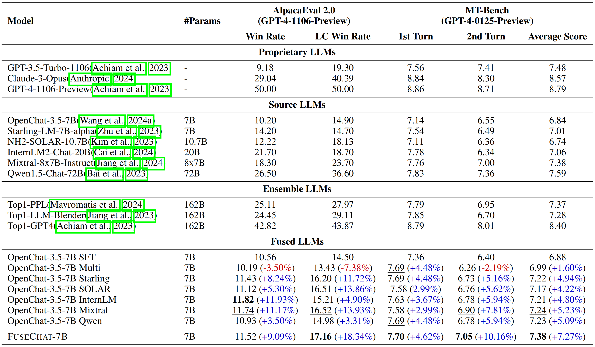

<p align="center" width="100%">
</p>

<div id="top" align="center">

Knowledge Fusion of Large Language Models
-----------------------------
 


<h4> |<a href="https://arxiv.org/abs/2401.10491"> 📑 FuseLLM Paper @ICLR2024 </a> |
<a href="https://arxiv.org/abs/2408.07990"> 📑 FuseChat Tech Report </a> |
<a href="https://arxiv.org/abs/2412.03187"> 📑 WRPO Tech Report </a> |
    
<a href="https://slit-ai.github.io/FuseChat-3.0/"> 🌐 Blog Post </a> |
<a href="https://huggingface.co/FuseAI"> 🤗 HuggingFace Repo </a> |
<a href="https://github.com/fanqiwan/FuseLLM"> 🐱 GitHub Repo </a> |
</h4>

<p align="center">
     <br>
</p>

</div>


## News

### FuseChat-3.0 [SOTA 8B LLM on AlpacaEval-2 & Arena-Hard]

- **Dec 12, 2024:** 🔥 We release [FuseChat-3.0](https://huggingface.co/collections/FuseAI/fusechat-30-6752d18dec430bad7a236a75) and [Blog Post](https://slit-ai.github.io/FuseChat-3.0/). FuseChat-3.0 contains a series of models crafted to enhance performance by integrating the strengths of multiple source LLMs into more compact target LLMs. To achieve this fusion, we utilized four powerful source LLMs: [Gemma-2-27b-It](https://huggingface.co/google/gemma-2-27b-it), [Mistral-Large-Instruct-2407](https://huggingface.co/mistralai/Mistral-Large-Instruct-2407), [Qwen-2.5-72B-Instruct](https://huggingface.co/Qwen/Qwen2-72B-Instruct), and [Llama-3.1-70B-Instruct](https://huggingface.co/meta-llama/Llama-3.1-70B-Instruct). For the target LLMs, we employed three widely-used smaller models—[Llama-3.1-8B-Instruct](https://huggingface.co/meta-llama/Llama-3.1-8B-Instruct), [Gemma-2-9B-It](https://huggingface.co/google/gemma-2-9b-it), and [Qwen-2.5-7B-Instruct](https://huggingface.co/Qwen/Qwen2.5-7B-Instruct)—along with two even more compact models—[Llama-3.2-3B-Instruct](https://huggingface.co/meta-llama/Llama-3.2-3B-Instruct) and [Llama-3.2-1B-Instruct](https://huggingface.co/meta-llama/Llama-3.2-1B-Instruct). . The implicit model fusion process involves a two-stage training pipeline comprising Supervised Fine-Tuning (SFT) to mitigate distribution discrepancies between target and source LLMs, and Direct Preference Optimization (DPO) for learning preferences from multiple source LLMs. The resulting FuseChat-3.0 models demonstrated substantial improvements in tasks related to general conversation, instruction following, mathematics, and coding. Notably, when Llama-3.1-8B-Instruct served as the target LLM, our fusion approach achieved an average improvement of **6.8** points across 14 benchmarks. Moreover, it showed significant improvements of **37.1** and **30.1** points on instruction-following test sets AlpacaEval-2 and Arena-Hard respectively.  

<p align="center">
     <br>
</p>

### FuseChat [SOTA 7B LLM on MT-Bench]

- **Aug 16, 2024:** 🔥🔥🔥🔥 We update the [FuseChat tech report](https://arxiv.org/abs/2408.07990) and release [FuseChat-7B-v2.0](https://huggingface.co/FuseAI/FuseChat-7B-v2.0), which is the fusion of six prominent chat LLMs with diverse architectures and scales, namely [OpenChat-3.5-7B](https://huggingface.co/openchat/openchat_3.5), [Starling-LM-7B-alpha](https://huggingface.co/berkeley-nest/Starling-LM-7B-alpha), [NH2-Solar-10.7B](https://huggingface.co/NousResearch/Nous-Hermes-2-SOLAR-10.7B), [InternLM2-Chat-20B](https://huggingface.co/internlm/internlm2-chat-20b), [Mixtral-8x7B-Instruct](https://huggingface.co/mistralai/Mixtral-8x7B-Instruct-v0.1), and [Qwen1.5-Chat-72B](https://huggingface.co/Qwen/Qwen1.5-72B-Chat). FuseChat-7B-v2.0 achieves an average performance of **7.38** on MT-Bench (GPT-4-0125-Preview as judge LLM), which is comparable to [Mixtral-8x7B-Instruct](https://huggingface.co/mistralai/Mixtral-8x7B-Instruct-v0.1) and approaches [GPT-3.5-Turbo-1106](https://platform.openai.com/docs/models/gpt-3-5-turbo).  


- **Mar 13, 2024:** 🔥🔥🔥 We release a HuggingFace Space for [FuseChat-7B](https://huggingface.co/spaces/FuseAI/FuseChat-7B), try it now!

- **Feb 26, 2024:** 🔥🔥 We release [FuseChat-7B-VaRM](https://huggingface.co/FuseAI/FuseChat-7B-VaRM), which is the fusion of three prominent chat LLMs with diverse architectures and scales, namely [NH2-Mixtral-8x7B](https://huggingface.co/NousResearch/Nous-Hermes-2-Mixtral-8x7B-DPO), [NH2-Solar-10.7B](https://huggingface.co/NousResearch/Nous-Hermes-2-SOLAR-10.7B), and [OpenChat-3.5-7B](https://huggingface.co/openchat/openchat_3.5). FuseChat-7B-VaRM achieves an average performance of **8.22** on MT-Bench, outperforming various powerful chat LLMs like [Starling-7B](https://huggingface.co/berkeley-nest/Starling-LM-7B-alpha), [Yi-34B-Chat](https://huggingface.co/01-ai/Yi-34B-Chat), and [Tulu-2-DPO-70B](https://huggingface.co/allenai/tulu-2-dpo-70b), even surpassing [GPT-3.5 (March)](https://platform.openai.com/docs/models/gpt-3-5-turbo), [Claude-2.1](https://www.anthropic.com/news/claude-2-1), and approaching [Mixtral-8x7B-Instruct](https://huggingface.co/mistralai/Mixtral-8x7B-Instruct-v0.1).

- **Feb 25, 2024:** 🔥 We release [FuseChat-Mixture](https://huggingface.co/datasets/FuseAI/FuseChat-Mixture), which is a comprehensive training dataset covers different styles and capabilities, featuring both human-written and model-generated, and spanning general instruction-following and specific skills.

<p align="center">
     <br>
</p>

<p align="center">
     <br>
</p>


### FuseLLM [Surpassing Llama-2-7B]

- **Jan 22, 2024:** 🔥 We release [FuseLLM-7B](https://huggingface.co/Wanfq/FuseLLM-7B), which is the fusion of three open-source foundation LLMs with distinct architectures, including [Llama-2-7B](https://huggingface.co/meta-llama/Llama-2-7b-hf), [OpenLLaMA-7B](https://huggingface.co/openlm-research/open_llama_7b_v2), and [MPT-7B](https://huggingface.co/mosaicml/mpt-7b).

<p align="center">
     <br>
</p>

<p align="center">
     <br>
</p>


## Citation

Please cite the following paper if you reference our model, code, data, or paper related to FuseLLM.
```
@inproceedings{wan2024knowledge,
  title={Knowledge Fusion of Large Language Models},
  author={Fanqi Wan and Xinting Huang and Deng Cai and Xiaojun Quan and Wei Bi and Shuming Shi},
  booktitle={The Twelfth International Conference on Learning Representations},
  year={2024},
  url={https://openreview.net/pdf?id=jiDsk12qcz}
}
```

Please cite the following paper if you reference our model, code, data, or paper related to FuseChat.
```
@article{wan2024fusechat,
  title={FuseChat: Knowledge Fusion of Chat Models},
  author={Fanqi Wan and Longguang Zhong and Ziyi Yang and Ruijun Chen and Xiaojun Quan},
  journal={arXiv preprint arXiv:2408.07990},
  year={2024}
}
```

Please cite the following paper if you reference our model, code, data, or paper related to WRPO.
```
@article{yang2024wrpo,
  title={Weighted-Reward Preference Optimization for Implicit Model Fusion},
  author={Ziyi Yang and Fanqi Wan and Longguang Zhong and Tianyuan Shi and Xiaojun Quan},
  journal={arXiv preprint arXiv:2412.03187},
  year={2024}
}
```

## Star History

[](https://star-history.com/#fanqiwan/FuseLLM&Timeline)
